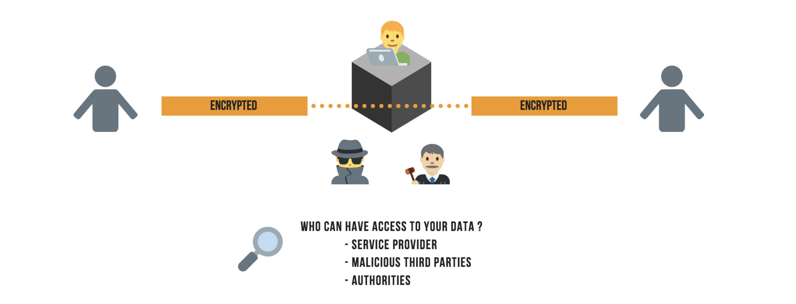
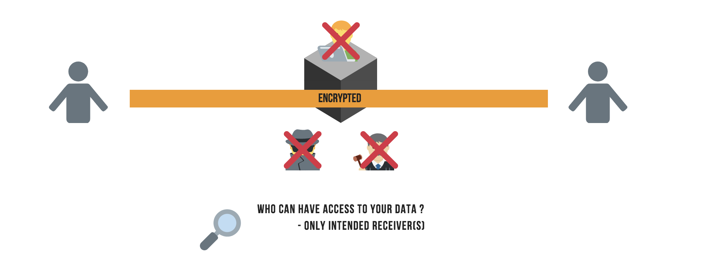
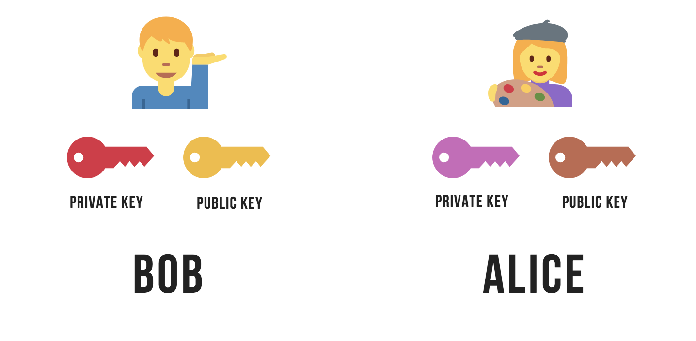
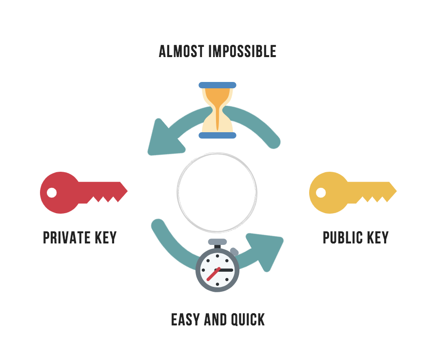
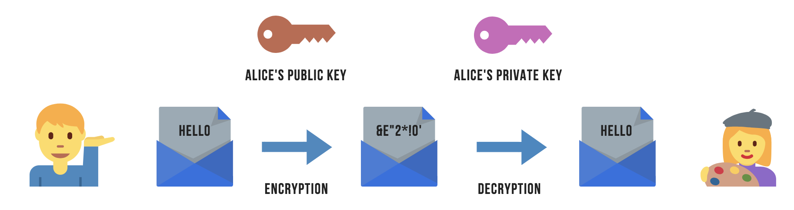
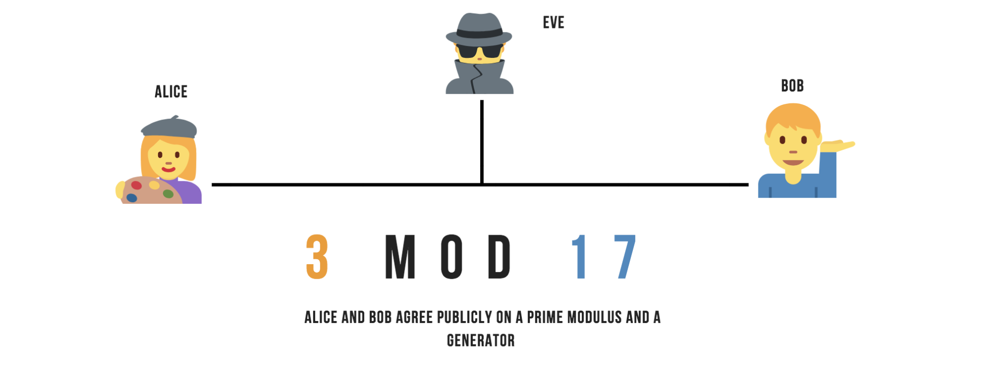
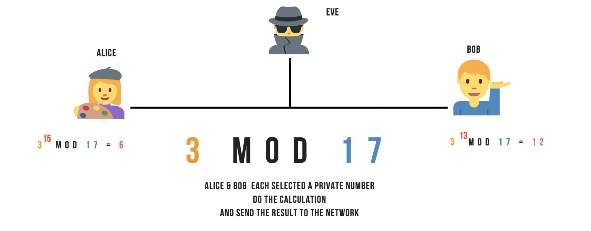
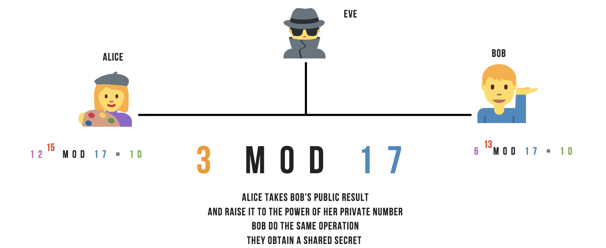

# What is End-to-End encryption (E2EE)?

You have probably already heard about [cryptography](https://berty.tech/blog/history-cryptography/) and, more specifically, about end-to-end encryption. But do you know what it really is?

In this article, you’ll learn more about this method at the heart of many (but not all) secure instant messaging applications. Encryption is a computer algorithm that ensures that the data you exchange with one or more people can only be read by the correct recipient, and not by a random person who may be malicious.

There is a simple principle of confidentiality: every time you send any information over the Internet, whether it has a value or not, it must be encrypted. If you don't do this, anyone (for example, people using the hotel's wifi network) can easily steal it. Almost all websites use encryption when it comes to passwords, credit card numbers, online banking information or similar sensitive information. If we weren’t encrypting such information, fraud and identity theft would be widespread. Encryption is a basic prerequisite for the use of the Internet.

 

## Different Types of Encryption

Encryption is a kind of digital envelope that prevents the data placed in this envelope from being read, with the exception of the sender and the recipient(s). Encryption can be applied at different levels. There are two types of encryption:

***Encryption in transit:*** The data is encrypted when it is transmitted between your device and a server (a service provider such as your telephone operator) and then the data is encrypted again to be transmitted to the recipient(s). This way, the data is secured on the way. But what is important to remember is that the service provider has access to the data in its unencrypted form. The provider is able to read all the communication and you have no choice but to trust him to protect the data you transmit in the best way possible.

***End-to-end encryption:*** With this type of encryption, data is encrypted to the end between you and the person you are talking to, which means no intermediaries. The service provider only transmits the encrypted data, but cannot preview the content. Only the sender and the recipient(s) can read the data.

## How does End-to-End Encryption work?

It must be understood that for data to be protected by end-to-end encryption, a set of keys is required. A key is a series of characters, numbers and special characters.

Conceptually, it is a unique code. In end-to-end encryption, it is mandatory to generate at least two keys:

- a public key, which will be used for encryption

- a private key that will be used for decryption
- 

As their names suggest: the public key is visible to everyone and the private key is personal. These keys are not the same, which is why this setup is commonly referred to as “asymmetric encryption”. The private key is generated randomly and the public key is generated using the private key. It is very simple to create the public key from the private key but it is very hard (takes time) to find the private key from the public key. Otherwise it would be too straightforward.

 

## A simple example: Alice and Bob

The message receiver (Alice) generates a private key and a public key. The receiver of the message (Alice) sends his public key to a sender (Bob). The sender (Bob) encrypts his message with the public key of the receiver (Alice). The receiver (Alice) decrypts the sender's message (Bob) using her private key. Only the receiver (Alice) will be able to read the messages from the sender (Bob).

It is sufficient for the sender (Bob) to apply the same process as the receiver (Alice) and this public key exchange allows them to communicate securely in both directions.

 

## ECDH: Diffie-Hellman key exchanges

That was for the theoretical part. In practice, it takes time to encrypt and decrypt with an algorithm based on asymmetric keys. Indeed, it is much easier to decipher a message from a symmetrical (identical) key. However, if a third party finds this key, the data exchange is no longer secure. You easily understand that it is very difficult to exchange a password on a public network - to exchange a symmetrical key on a network that is being monitored.

This is where the key exchange developed by Diffie-Hellman comes in. This protocol is based on a rather complex mathematical algorithm, but its use is quite simple to understand. Imagine Bob and Alice are being spied on by a third party called Eve. The only way for Alice and Bob is to go through a third party who is not really trusted. They must therefore use deception to exchange their messages in a secure way. Diffie-Hellman's algorithm allows the creation of a private key between two parties, via the exchange of messages on an unsecured network. When establishing a key with Diffie-Hellman algorithm, messages are sent openly on the network, and anyone who intercepts the transmitted messages should not be able to deduce the generated key from it.

-   Alice and Bob each choose a very large random number, which they keep secret. Let x be the number chosen by Alice, and y be the number chosen by Bob.

-   Alice calculates P1 = g^x mod p, and transmits the result to Bob

-   Bob calculates P2 = g^y mod p, and transmits the result to Alice

-   Alice calculates K1 = P2^x mod p, and Bob calculates K2 = P1^x mod p

At this point, the value K1 calculated by Alice is therefore (g^y mod p)^x mod p. The value K2 calculated by Bob is (g^x mod p)^y mod p. The laws of arithmetic prove that the two values K1 and K2 are equal. Alice and Bob were able to agree on a common private key.

Confidentiality is guaranteed by the fact that a possible attacker, who would intercept communications between Alice and Bob, would have no way of finding the private key from the information transmitted publicly. x and y being very large numbers, it is indeed extremely complex to find their value from the information openly transmitted: p, g, P1 and P2. And without x and y, it is impossible to find the final key. You can check this excellent youtube video for further explanations. No one else but Alice and Bob knows this shared secret because no one else has a private key.



 

The greatest weakness of Diffie Hellman's exchange is that it alone does not establish the identity of the other party (lack of authentication), which makes it prone to an attack by the middle man.

During the key exchange with Diffie-Hellman, each of the two parties has no proof that they are communicating with the appropriate interlocutor directly. An attacker, Eve, can very well intercept the messages exchanged, and rewrite them to pretend to be Bob to Alice, and Alice to Bob. Since Diffie Hellman doesn't establish an identity, when Alice thinks he's negotiating a key with Bob, he's actually negotiating with Eve, and the same (separately) for Bob, then everyone thinks he's communicating securely with the other, when in fact, they each have a secure single-key connection with the hacker who reads their messages, then re-encrypts them and sends them, or reads them and sends different messages instead.

Ideally, Diffie-Hellman should therefore be used with a recognized authentication method such as digital signatures. Maybe we'll talk about it in a future blogpost?

Cheers Internet, feel free to clap & follow our stories, see you next time. 🤫  
 
