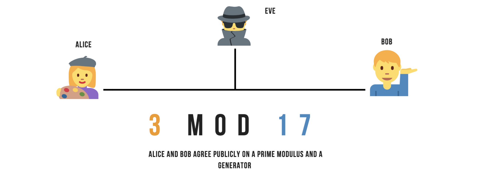

# 什么是端到端加密(E2EE)？

您可能已经听说过 [加密技术](https://berty.tech/blog/history-cryptography/) ，更具体地说，是端到端加密。 但你是否真了解它是什么呢？

在这篇文章中，您将会更多地了解这种在许多(但不是所有) 安全即时通讯应用程序的核心方法。 加密是一种计算机算法，确保您与一个或多个人交换的数据只能由正确的收件人阅读， 而不是随便的一个人而且他可能是恶意的。

有一个简单的保密原则：每次您通过因特网发送任何信息。 无论其是否有价值，都必须加密。 如果您不这样做，任何人(例如使用旅馆WiFi的人) 都可以轻松地偷窃。 几乎所有网站在密码、信用卡号码、在线银行信息或类似敏感信息时都使用加密。 如果我们不加密这类信息，欺诈和盗用身份的现象将很普遍。 加密是使用互联网的基本先决条件。

 

## 不同的加密类型

加密是一种数字信封，防止除发件人和收件人之外的人读取放在这个信封中的数据， 加密可以应用在不同的层级。 有两种加密方式：

***中转加密：*** 当数据在您的设备和服务器之间传输时(例如您的电话运营商) 被加密，将其传输给收件人时再次加密。 这样，数据就在传输过程中就安全了。 但重要的是要记住这一点：服务提供者能够以未加密的形式查阅数据。 提供商能够阅读所有通讯，您别无选择，只能信任他以尽可能最好的方式保护您传输的数据。

***端到端加密：*** 使用这种类型的加密，数据从你到接收者之间都被加密，这意味着没有中间人。 服务提供商只能传输加密数据，但不能预览内容。 只有发件人和收件人才能读取数据。

## 端到端加密是如何工作的？

必须要理解的是，数据需要一组密钥才能通过端到端加密来保护。 一个密钥是一系列字符、数字和特殊字符。

从概念上讲，它是一个独特的规则。 在端到端加密中，必须至少生成两个密钥：

- 一个公钥，用于加密

- 一个用于解密的私钥
- 

正如他们的名字所表明的那样：公用钥匙对每个人都是可见的，私人钥匙则是私有的。 这些密钥并不相同，这就是为什么这种设置通常被称为“非对称加密”。 私钥随机生成，公钥使用私钥生成。 从私人钥匙中创建公用钥匙是非常简单的，但要从公用钥匙中找到私人钥匙是非常困难的(需要时间)。 否则，那就太简单了。

 

## 一个简单的示例：Alice和Bob

The message receiver (Alice) generates a private key and a public key. The receiver of the message (Alice) sends his public key to a sender (Bob). The sender (Bob) encrypts his message with the public key of the receiver (Alice). The receiver (Alice) decrypts the sender's message (Bob) using her private key. Only the receiver (Alice) will be able to read the messages from the sender (Bob).

It is sufficient for the sender (Bob) to apply the same process as the receiver (Alice) and this public key exchange allows them to communicate securely in both directions.

 

## ECDH: Diffie-Hellman key exchanges

That was for the theoretical part. In practice, it takes time to encrypt and decrypt with an algorithm based on asymmetric keys. Indeed, it is much easier to decipher a message from a symmetrical (identical) key. However, if a third party finds this key, the data exchange is no longer secure. You easily understand that it is very difficult to exchange a password on a public network - to exchange a symmetrical key on a network that is being monitored.

This is where the key exchange developed by Diffie-Hellman comes in. This protocol is based on a rather complex mathematical algorithm, but its use is quite simple to understand. Imagine Bob and Alice are being spied on by a third party called Eve. The only way for Alice and Bob is to go through a third party who is not really trusted. They must therefore use deception to exchange their messages in a secure way. Diffie-Hellman's algorithm allows the creation of a private key between two parties, via the exchange of messages on an unsecured network. When establishing a key with Diffie-Hellman algorithm, messages are sent openly on the network, and anyone who intercepts the transmitted messages should not be able to deduce the generated key from it.

-   Alice and Bob each choose a very large random number, which they keep secret. Let x be the number chosen by Alice, and y be the number chosen by Bob.

-   Alice calculates P1 = g^x mod p, and transmits the result to Bob

-   Bob calculates P2 = g^y mod p, and transmits the result to Alice

-   Alice calculates K1 = P2^x mod p, and Bob calculates K2 = P1^x mod p

At this point, the value K1 calculated by Alice is therefore (g^y mod p)^x mod p. The value K2 calculated by Bob is (g^x mod p)^y mod p. The laws of arithmetic prove that the two values K1 and K2 are equal. Alice and Bob were able to agree on a common private key.

Confidentiality is guaranteed by the fact that a possible attacker, who would intercept communications between Alice and Bob, would have no way of finding the private key from the information transmitted publicly. x and y being very large numbers, it is indeed extremely complex to find their value from the information openly transmitted: p, g, P1 and P2. And without x and y, it is impossible to find the final key. You can check this excellent youtube video for further explanations. No one else but Alice and Bob knows this shared secret because no one else has a private key.



 

The greatest weakness of Diffie Hellman's exchange is that it alone does not establish the identity of the other party (lack of authentication), which makes it prone to an attack by the middle man.

During the key exchange with Diffie-Hellman, each of the two parties has no proof that they are communicating with the appropriate interlocutor directly. An attacker, Eve, can very well intercept the messages exchanged, and rewrite them to pretend to be Bob to Alice, and Alice to Bob. Since Diffie Hellman doesn't establish an identity, when Alice thinks he's negotiating a key with Bob, he's actually negotiating with Eve, and the same (separately) for Bob, then everyone thinks he's communicating securely with the other, when in fact, they each have a secure single-key connection with the hacker who reads their messages, then re-encrypts them and sends them, or reads them and sends different messages instead.

Ideally, Diffie-Hellman should therefore be used with a recognized authentication method such as digital signatures. Maybe we'll talk about it in a future blogpost?

Cheers Internet, feel free to clap & follow our stories, see you next time. 🤫  
 
