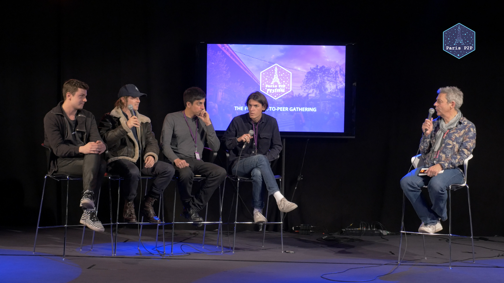
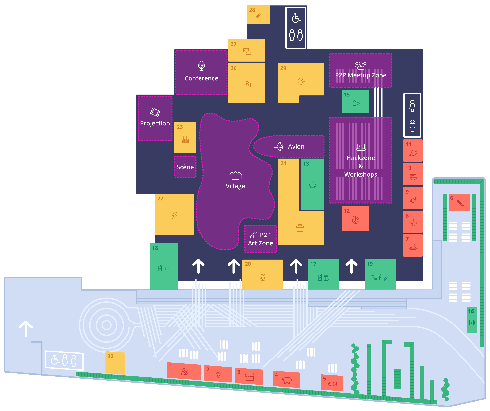

# Berty op Parijs P2P Festival #0

Zoals aangekondigd in onze vorige [blogpost](https://berty.tech/blog/paris-p2p-festival/), We hadden het genoegen om het allereerste [Parijs P2P Festival](https://p2p.paris/fr/event/festival-0/) van 8 tot en met 12 januari 2020 in Parijs te organiseren. Dit evenement was een echte kans om peer-to-peer enthousiastelingen en mensen te verenigen die nieuwsgierig zijn naar open source in het algemeen. Dit waren 5 intense dagen van delen, leren en kans ontmoetingen!

TLDR: We hadden een geweldige tijd! 🤩

## P2P Festival #0

 We hadden het genoegen 73 sprekers uit de hele wereld welkom te mogen heten in het kader van de 96 gebeurtenissen van het festival. Onderwerpen variëren van veilige communicatie, het delen van kennis, participatieve governance en digitale valuta's tot kunst en mentalisme.

Wat een line-up! 🤯 Neem een glimp onder 👇

* [De planning](https://p2p.paris/en/event/festival-0/#schedule)
* [Lijst van sprekers](https://p2p.paris/en/event/festival-0/#speakers)
* [Video's](https://www.youtube.com/playlist?list=PLNeNFYqVeWnPCNQTD9Q_YLJkjWYw78Ia_)

Dit festival was echt peer-to-peer!

### Grond controle

We hebben geprofiteerd van een ideale instelling in een vorige postsorteerzaal - [Ground Control](https://www.groundcontrolparis.com/), een voedselrechtbank met een gigantische ruimte! Deze site stelde ons in staat om alle verschillende ruimtes te definiëren die nodig zijn voor het evenement.

 

## Berty at P2P Festival #0

Members of the Berty team had discussions with many very interesting people: exchanges with people from the legal, political and technical world with their own projects. We had the chance to talk to activists who want to use Berty to protect their communication, as well as with journalists. It was so interesting and rewarding to realize that Berty can be used by so many diverse people.

### Berty Team Talks

Manfred, Antoine and Pierre had the opportunity to present talks during the festival. 😎

#### 👉 Talks by Manfred:

* General presentation of Berty.
    * [On Paris P2P website](https://p2p.paris/en/talks/maintream-intro-berty-protocol/)
    * [YouTube Video](https://youtu.be/fnl7Omsbpbw)
* How to Join and Contribute to Open Source Communities
    * [On Paris P2P website](https://p2p.paris/en/talks/join-contribute-open-source-projects/)
    * [YouTube Video](https://youtu.be/Q9349cmLYg8)

#### 👉 Antoine's talk:

* Introduction to IPFS and Berty Protocol
    * [On Paris P2P website](https://p2p.paris/fr/talks/introduction-ipfs-berty-protocol/)
    * [YouTube Video](https://www.youtube.com/watch?v=jtAtIsyUn0A)

#### 👉 Talk from Pierre:
* Social Engineering VS Mentalism
    * [On Paris P2P website](https://p2p.paris/en/talks/social-engineering-mentalist/)
    * *No video available*

## What's next?

For those of you who couldn't make it to this Paris P2P festival, no worries, it's probably the first round of a long series! 😉

We organize Paris P2P Monthly meetings every first Wednesday of the month at Ground Control (https://p2p.paris/en/) If you would like to be informed of the upcoming dates, sign up for our [Newsletter](https://crpt.fyi/berty-news) to make sure you don't miss anything.

### Thanks

We would like to thank our co-organizers ([Osmose Collective](https://osmose.world/), PhilH, Louise, Gorhgorh and all the people who contributed in any way to the organization of this festival), and all people who proposed talks, workshops and sessions. So many enriching meeting points that allowed P2P communities to come together, in such a beautiful setting! So, thank you all  👏

 
