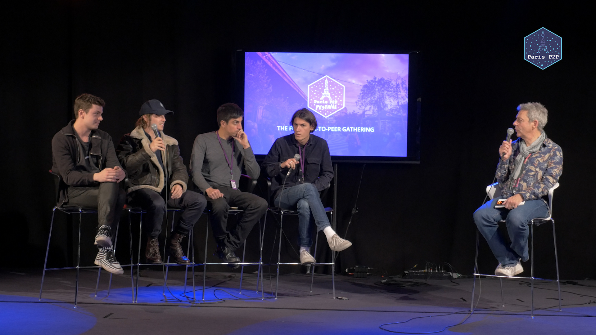
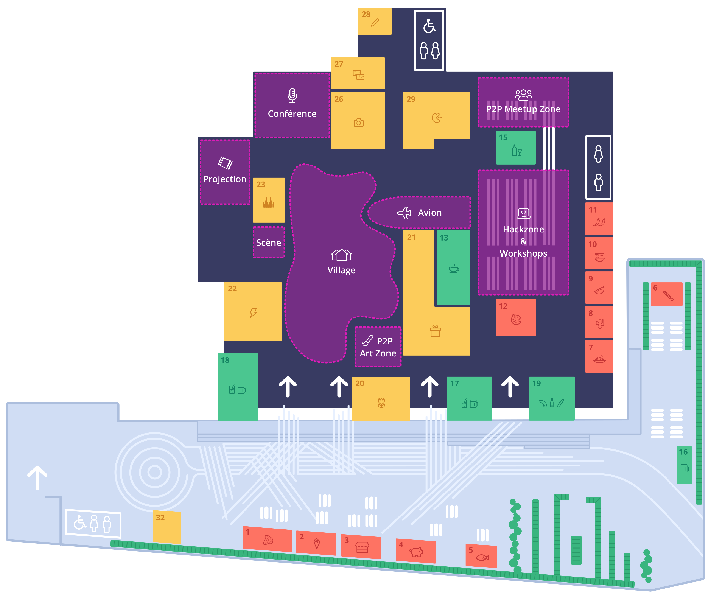

# Berty at Paris P2P Festival #0

As announced in our previous [blog post](https://berty.tech/blog/paris-p2p-festival/), we had the pleasure to co-organize the very first [Paris P2P Festival](https://p2p.paris/fr/event/festival-0/) from January 8 to 12, 2020 in Paris. This event was a true opportunity to bring together peer-to-peer enthusiasts and people curious about open source in general. These were 5 intense days of sharing, learning and chance encounters!

TLDR: We had a blast! 🤩

## P2P Festival #0

 We had the pleasure to welcome 73 speakers from all over the world to cover the 96 events of the festival. Topics ranged from secure communication, knowledge sharing, participative governance and digital currencies to art and mentalism.

What a line-up! 🤯 Have a glimpse below 👇

* [The schedule](https://p2p.paris/en/event/festival-0/#schedule)
* [List of speakers](https://p2p.paris/en/event/festival-0/#speakers)
* [Videos](https://www.youtube.com/playlist?list=PLNeNFYqVeWnPCNQTD9Q_YLJkjWYw78Ia_)

This festival was truly peer-to-peer!

### Ground Control

We benefited from an ideal setting located in a former postal sorting hall - [Ground Control](https://www.groundcontrolparis.com/), a food court offering a gigantic space! This site     allowed us to define all the different spaces needed for the event.

 

## Berty at P2P Festival #0

Members of the Berty team had discussions with many very interesting people: exchanges with people from the legal, political and technical world with their own projects. We had the chance to talk to activists who want to use Berty to protect their communication, as well as with journalists. It was so interesting and rewarding to realize that Berty can be used by so many diverse people.

### Berty Team Talks

Manfred, Antoine and Pierre had the opportunity to present talks during the festival. 😎

#### 👉 Talks by Manfred:

* General presentation of Berty.
    * [On Paris P2P website](https://p2p.paris/en/talks/maintream-intro-berty-protocol/)
    * [YouTube Video](https://youtu.be/fnl7Omsbpbw)
* How to Join and Contribute to Open Source Communities
    * [On Paris P2P website](https://p2p.paris/en/talks/join-contribute-open-source-projects/)
    * [YouTube Video](https://youtu.be/Q9349cmLYg8)

#### 👉 Antoine's talk:

* Introduction to IPFS and Berty Protocol
    * [On Paris P2P website](https://p2p.paris/fr/talks/introduction-ipfs-berty-protocol/)
    * [YouTube Video](https://www.youtube.com/watch?v=jtAtIsyUn0A)

#### 👉 Talk from Pierre:
* Social Engineering VS Mentalism
    * [On Paris P2P website](https://p2p.paris/en/talks/social-engineering-mentalist/)
    * *No video available*

## What's next?

For those of you who couldn't make it to this Paris P2P festival, no worries, it's probably the first round of a long series! 😉

We organize Paris P2P Monthly meetings every first Wednesday of the month at Ground Control (https://p2p.paris/en/) If you would like to be informed of the upcoming dates, sign up for our [Newsletter](https://crpt.fyi/berty-news) to make sure you don't miss anything.

### Thanks

We would like to thank our co-organizers ([Osmose Collective](https://osmose.world/), PhilH, Louise, Gorhgorh and all the people who contributed in any way to the organization of this festival), and all people who proposed talks, workshops and sessions. So many enriching meeting points that allowed P2P communities to come together, in such a beautiful setting! So, thank you all  👏

 
