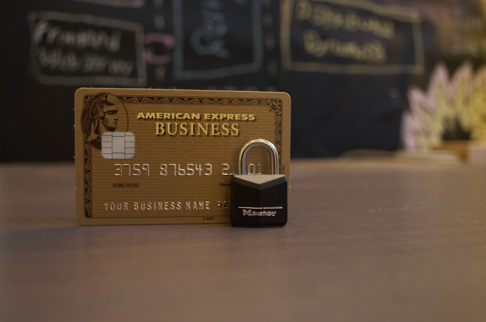
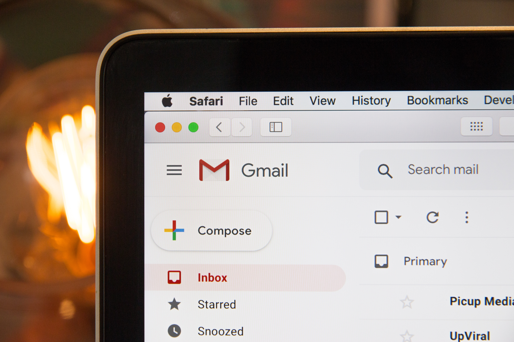
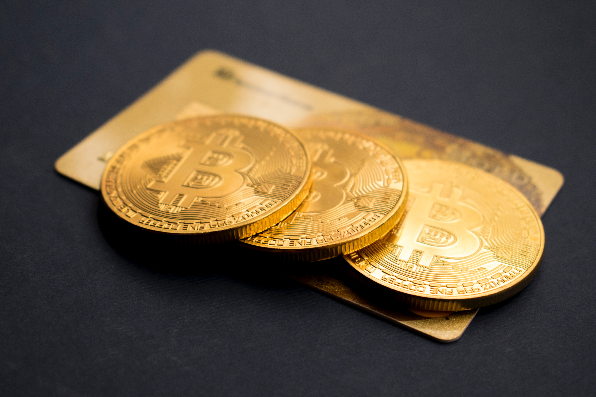
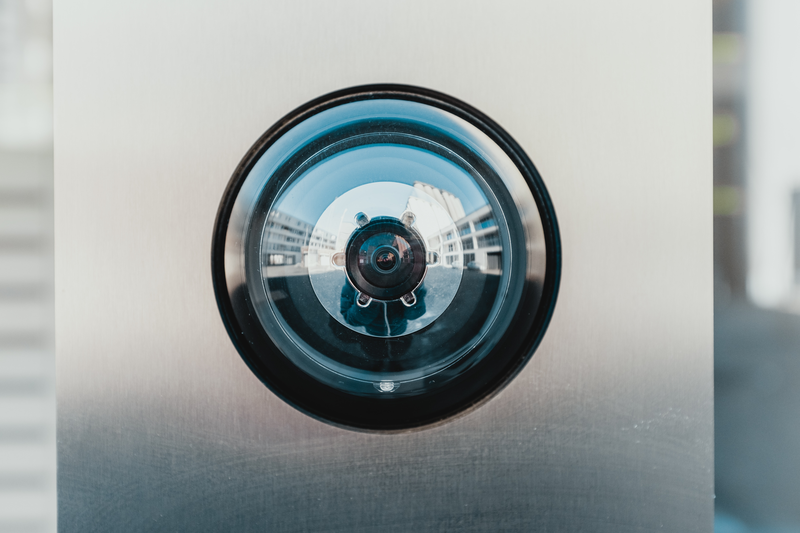

# Cryptography in Our Daily Usage

One could refer to cryptography as being meta-cryptic. In its own way, cryptography is a bit mysterious and probably vague to many people. You may not notice it, but we all use it without actually being aware of it most of the time.

Do you use debit and credit cards? Can you see the tiny lock in your browser’s address bar? Do you use a remote key to unlock your car? Yes, this is all based on the premise that the said devices will keep your information safe. This is what cryptography is all about.

## Everyday Cryptography Examples

So, now you know that cryptography is widely used in the life of a modern-day human being. That being said, it is always better that you at least know the basics of how it works. Before you, lie some of the main examples of cryptography used in our day-to-day lives. Even if you don’t use some of the items from this list, you’ve probably heard of them.

### HTTPS

Before learning what HTTPS is, you should know where it all started – HTTP. Short for HyperText Transfer Protocol, HTTP a basic internet protocol. It is used to transfer information across the World Wide Web, which is commonly referred to as “the internet.”

Yes, we’ve been using the web as we know it ever since 1990, and most of us don’t even know why there’s an “HTTP” in front of the “www” part of some internet addresses. No one blames you if you don’t know the answer, though. It is something that helps set the information free on the web. A deeper and more thorough explanation would require an article of its own.

So what’s HTTPS? Let’s just say that the plain old HTTP is more “plain” than you may suspect – the information stored in HTTP websites is transported as plain text. You don’t have to be an IT specialist to know that this isn’t particularly safe. It is fine for some websites, while it’s definitely not fine for eCommerce businesses. This latter also need to store relevant credit card information and other sensitive data.

So, a few smart IT pros decided to get together and clad the good old HTTP in cryptography-plated armor. This suit of armor was named Secure Socket Layer (SSL) and when worn by HTTP, a nearly-impenetrable fortress is created – HTTPS or Secure HyperText Transfer Protocol.

### Cash Withdrawal

You know that the banks are doing something to ensure that the cash withdrawal from your ATM remains a safe procedure. Although you really don’t need to know all the hows and whys, you should note that we’re talking about encryption here, too.

This type of encryption is called HSM, or Hardware Security Module encryption. This method protects the privacy of your PIN, as well as that of other sensitive information that’s stored on your credit or debit card. In essence, HSM encryption makes sure that the cybercriminals can’t intercept your PIN during the network data exchange, i.e. your interaction with the ATM.

### Email

Email apps and sites such as Hotmail and Gmail may not store sensitive credit card information but can serve as a gateway to it. In fact, your email address is often a unique piece of information that a cybercriminal needs to have in order to infect your computer or smartphone with adware, ransomware, or other types of malware. That’s why most webmail applications use SSL encryption, as well. But here’s a piece of bad news for your privacy: the HTTPS extension does not provide encryption for the text within your emails.

If you don’t mind the NSA reading your email, though, you shouldn’t really care about encrypting your texts. On the other hand, if the NSA can do it, someone else might be able to do it, as well.

However, end-to-end email providers do exist. If you want to keep your information as safe as possible, maybe consider moving away from the typical email apps and sites.

### Pay-TV

This might be the type of encryption that you aren’t a fan of (😅), but it is still present in your everyday life. The way pay-TV encryption works is it scrambles the data it sends to your receiver - in this case, video and audio.

The only way for your receiver to decrypt the data is to use the exact correct algorithm and security keys, made specifically for decrypting the program.

### Bitcoin

When you say “cryptography,” one might raise an eyebrow. When you say “crypto,” you’ll probably get “Oh, Bitcoin?”. Yes, Bitcoin - and, thanks to it, other cryptocurrencies have struck fame as of recently. So, does Bitcoin use encryption to ensure security?

Here’s a shocker: no, it doesn’t, at least not in the traditional sense of the word. The term “cryptocurrency” comes from the fact that the digital signature algorithm that cryptocurrencies use is essentially based on certain math techniques that are also used for elliptic curve encryption.

Bitcoin, however, revolves around public and private keys, which can be considered a type of encryption.

## Secure Your House!

The importance of cryptography and encryption is best explained on the example of your home. Let’s say that you’ve fitted the safest lock on the planet onto your front door. Let’s say that you’ve installed security cameras, bought guard dogs, as well as security lights. Now let’s say that you’ve left your back door open. A burglar could easily walk in, not having to worry about the security system.

It goes the same for your computer. Even if you’ve installed top-notch anti-malware software, all it takes is an infected USB and your information will be at risk.

With the IoT devices, cryptocurrencies, smartphones, cloud-based systems, and the increased use of each of the mentioned items, it is now, more than ever, vital that you pay attention to cryptography, privacy, and encryption.

**Be careful when browsing.** Stick to the websites that start with “https”. But it's not enough. In fact, you aren’t even safe on Facebook’s Messenger, even if you use the Secret Conversation option, because there can be backdoors asked by the government. You better stick to phone-number-based messengers that offer end-to-end encryption, such as Signal.

**Use VPN services** to ensure streaming and browsing privacy. It is a common misconception that these services are used only for online piracy. Many people care a lot about their online privacy, which is more than legitimate.

Finally, **use services such as ProtonMail and PGP** as your daily email address. Even if you think that you ' have nothing to hide'. Read here why you should stop saying this: https://berty.tech/blog/nothing-to-hide/

## Use Cryptography More and Everywhere

Cryptography and encryption are like locking the front door of your home. Most likely, no one will try to enter your home, but you’re doing it for the off-chance that someone might.

If using cryptography and encryption means being paranoid, so does locking your front door 🤪.

Of course, this doesn’t mean that you are completely safe. Yes, the more cryptography and encryption you use the safer you are, but it’s all for nothing if you aren’t careful enough.

Pozdrawiamy internet, możesz klaskać & śledzić nas, do zobaczenia następnym razem. 🤫  
 

Photo Credit: https://www.unsplash.com 
