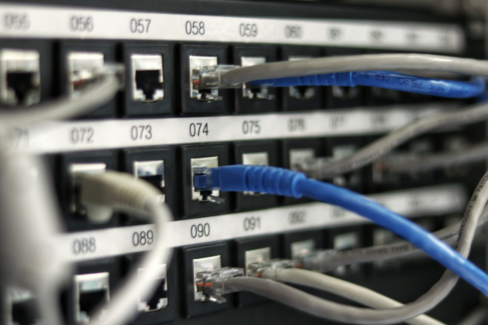

# Which One Should You Choose?

Centralized systems may have helped build the internet, but they have important disadvantages. That’s what decentralized and distributed systems try to address. Learn more about each type of system.

## The Importance of Different Systems
The centralized vs decentralized vs distributed systems debate is relevant to both individuals and organizations. It affects almost everyone who uses the web. It’s at the core of the development and evolution of networks, financial systems, companies, apps, web services, and more.

While all these systems can function effectively, some are more stable and secure than others by design. Systems can be very small, interconnecting only a few devices and a handful of users. Or they can be immense and span countries and continents. Either way, they face the same challenges: fault tolerance, maintenance costs, and scalability.

The internet itself is the world’s largest network. So large in fact that it brings together all these different systems into a vast digital ecosystem. But for most organizations and individuals, using all these systems is not feasible. They have to choose. And you may have to choose, too.

. On Distributed Communications, Memorandum RM-3420-PR.")

## Centralized Systems
In a centralized system, all users are connected to a central network owner or “server”. The central owner stores data, which other users can access, and also user information. This user information may include user profiles, user-generated content, and more. A centralized system is easy to set up and can be developed quickly.

 

But this system has an important limitation. If the server crashes, the system no longer works properly and users cannot access the data. Because a centralized system needs a central owner to connect all the other users and devices, the availability of the network depends on this owner. Add to that the obvious security concerns that arise when one owner stores (and can access) user data, and it’s easy to understand why centralized systems are no longer the first choice for many organizations.

### Pros
- Simple deployment  
- Can be developed quickly  
- Affordable to maintain  
- Practical when data needs to be controlled centrally  

### Cons
- Prone to failures  
- Higher security and privacy risks for users  
- Longer access times to data for users who are far from the server  

 

## Decentralized Systems

As its name implies, decentralized systems don’t have one central owner. Instead, they use multiple central owners, each of which usually stores a copy of the resources users can access.

A decentralized system can be just as vulnerable to crashes as a centralized one. However, it is by design more tolerant to faults. That’s because when one or more central owners or servers fail, the others can continue to provide data access to users.

 

Resources remain active if at least one of the central servers continue to operate. Usually, this means that system owners can repair faulty servers and address any other problems while the system itself continues to run as usual.

Server crashes in a decentralized system may affect the performance and limit access to some data. But in terms of overall system uptime, this system offers a big improvement over a centralized system.

Another advantage of this design is that the access time to the data is often faster. That’s because owners can create nodes in different regions or areas where user activity is high.

However, decentralized systems are still prone to the same security and privacy risks to users as centralized systems. And while their fault tolerance is higher, this comes at a price. Maintaining a decentralized system is usually more expensive.

### Pros
- Less likely to fail than a centralized system  
- Better performance  
- Allows for a more diverse and more flexible system  

### Cons
- Security and privacy risks to users  
- Higher maintenance costs  
- Inconsistent performance when not properly optimized  

 

## Distributed System

A distributed system is similar to a decentralized one in that it doesn’t have a single central owner. But going a step further, it eliminates centralization. In a distributed system, users have equal access to data, though user privileges can be enabled when needed. The best example of a vast, distributed system is the internet itself.

The distributed system enables users to share ownership of the data. Hardware and software resources are also allocated between users, which in some cases may improve the performance of the system. A distributed system is safe from the independent failure of components, which can improve its uptime considerably.

 

Distributed systems have evolved as a result of the limitations of the other systems. With increasing security, data storage, and privacy concerns, and the constant need for improving performance, distributed systems are the natural choice for many organizations.

It’s no surprise then that technologies using the distributed system – most notably the blockchain – are changing many industries.

### Pros
- Fault-tolerant  
- Transparent and secure  
- Promotes resource sharing  
- Extremely scalable  

### Cons
- More difficult to deploy  
- Higher maintenance costs  

## Centralized vs Decentralized vs Distributed Systems Comparison

Now that you have a better understanding of every system, let’s see how these systems compare with one another. The following head-to-head comparison focuses on key points like fault tolerance, maintenance, scalability, development, and evolution. For each of these, we are using simple ratings like low, moderate, and high.

### :muscle: Fault tolerance:
- Low: Centralized systems  
- Moderate: Decentralized systems  
- High: Distributed systems  

### :wrench: Maintenance:
- Low: Centralized systems  
- Moderate: Decentralized systems  
- High: Distributed systems  

### :rocket: Scalability:
- Low: Centralized systems  
- Moderate: Decentralized systems  
- High: Distributed systems  

### :moneybag: Development:
- Moderate: Decentralized systems, Distributed systems  
- High: Centralized systems  

### :chart_with_upwards_trend: Evolution:
- Low: Centralized systems  
- High: Decentralized systems, Distributed systems  

 

## Final Thoughts

As you can see, there are advantages and disadvantages to every system. Centralized systems helped the first networks grow and were the only choice before decentralized systems began to emerge.

Less prone to failure and offering faster access times, decentralized systems have provided a considerable improvement over the old systems. They continue to be very much in use today, especially since over the years they have become more affordable.

However, it’s only distributed systems that allocate resources and rights across the whole network. By doing so, they are not only remarkably tolerant to faults but also more transparent than other systems. As the adoption of distributed systems lowers their deployment and maintenance costs, these systems will likely prove an inspired choice in the years to come.

Pozdrawiamy internet, możesz klaskać & śledzić nas, do zobaczenia następnym razem. 🤫


