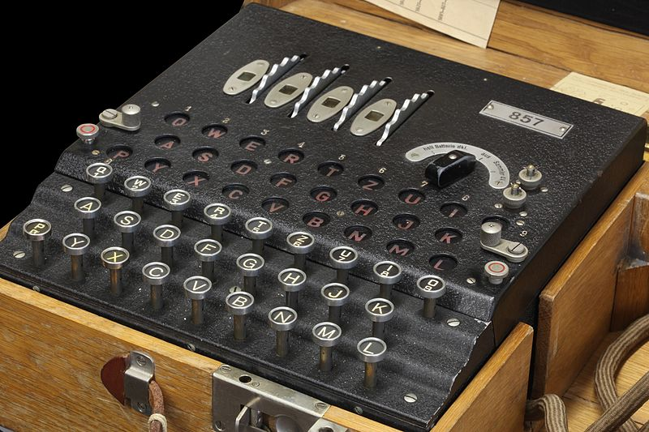

## The History  Of Cryptography

Does the word “cryptography” conjure for you images of British mathematicians working hard to decipher coded German messages during WWII? Perhaps. But to find its origins, we have to go back in time a few thousand years. :hourglass_flowing_sand:

### Origins of Cryptography
Over 5600 years ago, the Sumerians and the Egyptians needed a better way to record transactions. So they invented cuneiform and hieroglyphics, two of the oldest forms of writing. These writing systems may not look much like the words that you are reading now, but they combine simple logographic, alphabetic, and syllabic elements.

While the Sumerians and the Egyptians of old were familiar with these elements, to an outsider they would have been puzzling. No surprise then that it wasn’t until the 19th century that both of these languages were finally deciphered.

Cryptography, then, began in ancient times as a simplified system of notation. However, it wasn’t until Roman times that it engendered a more widely used encryption technique. Julius Caesar and other Roman emperors used simple ciphers to protect their private correspondence. At the time, letters and messages passed on by hand carried important information that could decide the fate of an army. But these could be easily intercepted and were not safe from prying eyes.

A simple substitution cipher like Caesar’s cipher encrypted messages by replacing a letter with another letter located a fixed number of places – say 3 – down the alphabet. In this way, “G” became “D” and “P” became “M”. It was painstaking at first, but it worked.

### New Ages, New Cyphers

Over time, more sophisticated ciphers evolved, including transposition ciphers. In these, letters are shifted and reordered, making the message more difficult to understand without a key. Here is an example of a simple transposition cipher:

 KTDEAVSOECTEHGAPRHAARTEHOTT 

To create this cipher, a spy would have first written the letters in a grid and then linked them together by reading them in a different order. In this example, he would have followed an inverted S pattern, starting with the last letter and ending with the first: 

 TTOHETRAA   

 HRPAGHETC   

 EOSVAEDTK   

Reading the letters horizontally, the encrypted message becomes clear :tada::

 <b>THE TROOPS HAVE GATHERED ATTACK</b> 

Over the centuries, ciphers became increasingly sophisticated, as did the methods that tried to decipher them, collectively known as cryptanalysis. A particularly effective form of cryptanalysis which was already known in the 9th century is frequency analysis. This studies how often letters and groups of letters repeat themselves in an encrypted text.

### Modern Age Cryptography

In the 19th and 20th century, the development of increasingly complex electromechanical machines ushered in a new age for cryptography. In 1835, Samuel F. Morse used cryptography as a simple character encoding scheme to enable the transmission of messages through the telegraph.

But in the next century, cryptography would find a much more dangerous use as a tool of war. In 1917, the Zimmerman Telegram sent by the German Foreign Office in the US to the German Ambassador to Mexico proposing a military alliance between Germany and Mexico was encrypted using German diplomatic code.

The decryption of the telegram by British Intelligence marked a turning point in history – The US’s entrance into WWI.

### Encryption and Decryption

More advanced cryptography techniques were used during WWII, powered by electromechanical rotor machines such as the Enigma and the Lorenz SZ40. This led to the development of even more sophisticated decryption machines that could perform calculations faster than a human cryptologist.

Perhaps the best-known decryption machine is the Bletchley Park Bombe. Alan Turing and other British cryptanalysts used it to break German Enigma codes during WWII. It’s estimated that their work and their improvements in decryption machines and techniques helped save as many as 21 million people.

Rotor machines made possible complex encryption methods, but it was the invention of the computer that took cryptography to a whole new level. Hardware-based encryption uses processors to increase not only the complexity of the encryption but also its speed. Computer-encrypted data can be very long and can use very advanced encryption algorithms that a human being would take a very long time to break.

But more than computers, it was the rise of the internet that took cryptography out of the shadows and made it an everyday necessity.

If encryption was initially the domain of the military, information agencies, and governments, the wide adoption of computers brought it into the public domain. The major drivers behind this have been the emergence of public encryption standards and public-key cartography.

### Symmetric and Asymmetric Encryption

In the digital age, cryptography has evolved into symmetric and asymmetric key encryption. Modern encryption uses a digital encryption algorithm to encrypt data. In the case of symmetric encryption, the same key is used by the sender and the recipient to decrypt and encrypt the data.

Asymmetric encryption is even more secure, as it encrypts data using the recipient’s public key, and decrypts it using his or her private key. The advantage of this type of encryption is that even if the key gets stolen, the data cannot be accessed without the private key. Julius Cesar would have been impressed.

### Online Encryption Systems

Today, online encryption governs the data exchange between web servers and web browsers through the SSL/TSL encryption protocol. Using data requests, security certificates, and different encryption keys, online encryption makes the early ciphers of the Romans seem like child’s play.

Encryption today is crucial to online transactions, secure communication, and safe data exchanges. Without encryption, the transfer of data over the internet can be misused. With encryption, it is difficult for hackers to make use of data even if they intercept it.

Individuals and organizations around the world use encryption methods whose roots can be traced to the early ciphers and cryptographic systems. Without cryptography, it is difficult to imagine the world of ecommerce and secure communications.

Cryptography continues to facilitate the adoption of new technologies, including advanced payment systems and software solutions.

### Cryptography in the Future: Cryptocurrency and the Blockchain

Cryptography underlies the emergence of cryptocurrency, which may revolutionize financial transactions by making them more secure and more convenient.

In the blockchain, asymmetric cryptography links blocks of data to create one of the most exciting new technologies. Blockchain can decentralize systems, apps, and transactions. It can make the web not only safer for everyone – sellers and buyers – but more transparent.

In the end, the history of cryptography is the history of human kind’s relentless drive to find better ways to protect information and secure communications. Without it, the internet as we know it, and the digital age, would not be possible.

Cheers Internet, feel free to clap & follow our stories, see you next time. 🤫

 
