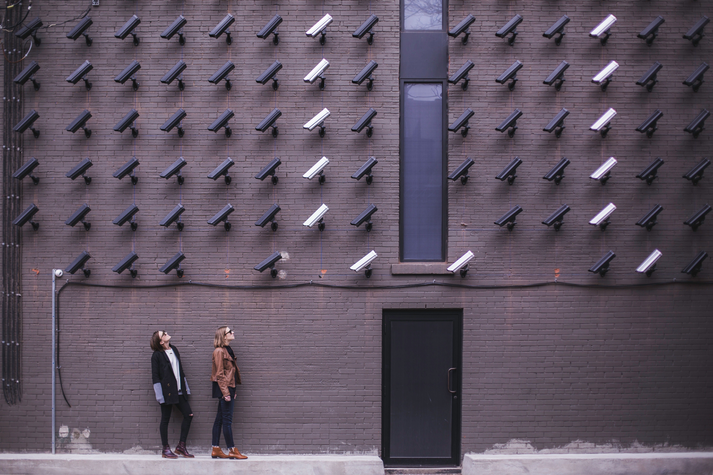
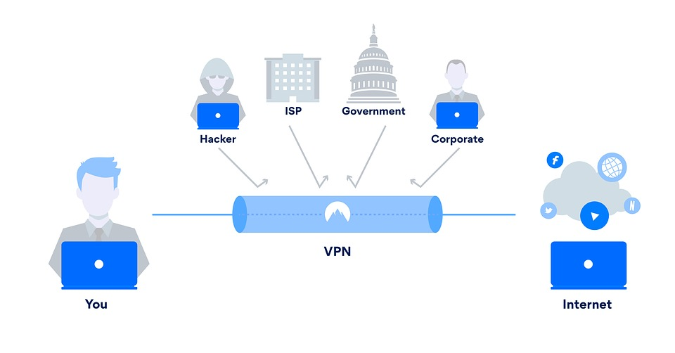
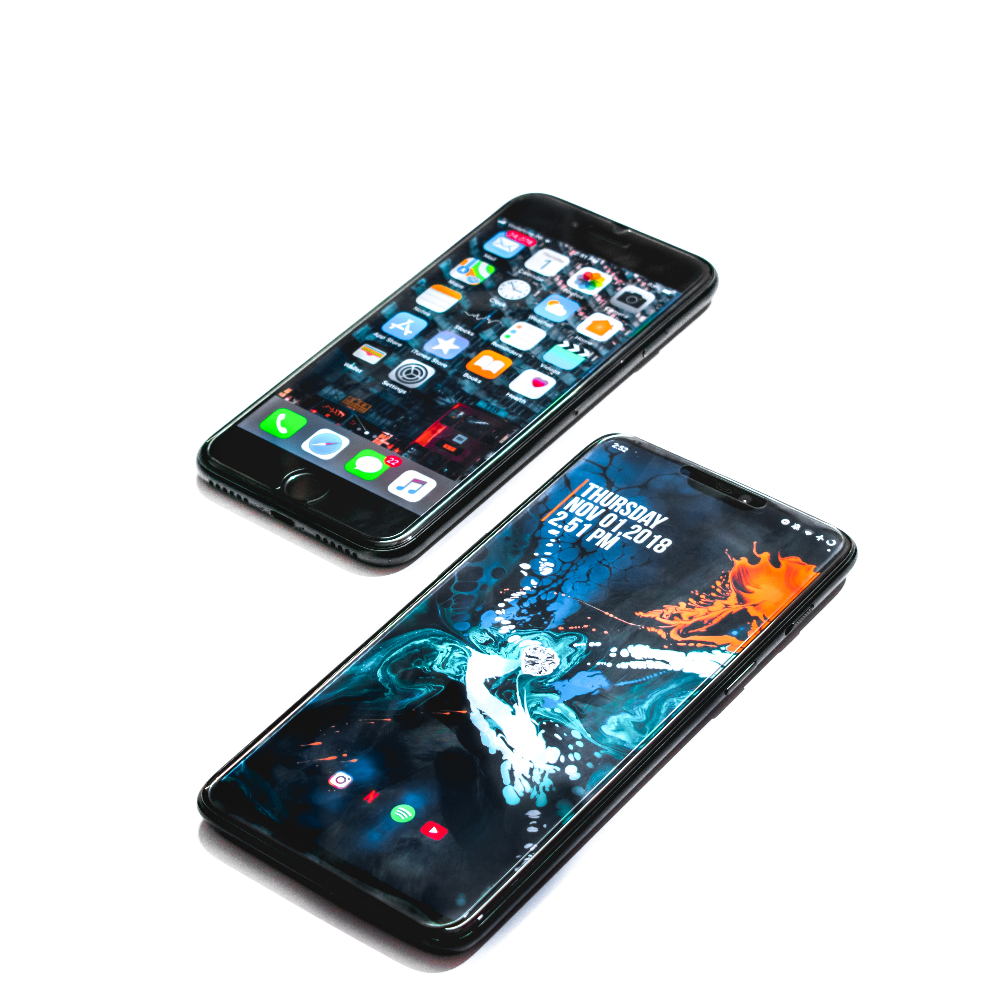

# Setting up VPN

With global surveillance growing more prevalent every day, even an ordinary internet user might feel a real need to protect their personal data and browsing habits from the prying eyes of the government and data-harvesting agencies. The most popular way to achieve the above is with a VPN (virtual private network) service. Before we get to how to set up VPN on your mobile device, let’s find out what we’re up against.

## Surveillance Alliances

 

We’re up against international surveillance alliances known as [5 eyes, 9 eyes, and 14 eyes](https://restoreprivacy.com/5-eyes-9-eyes-14-eyes/). The metaphorical “eyes” refer to countries. In the name of national security, they cooperate in data collection and internet user surveillance.

**5 Eye**   The United States, the United Kingdom, New Zealand, Canada, and Australia make up the 5 eyes. The alliance goes back to right after WWII when it was just the US and the UK., The other three countries joined later.

**9 Eyes**   Add France, Norway, Netherlands, and Denmark into the mix and you get 9 Eyes. Of course, they don’t exactly come out and tell people that they are the 9 Eyes. They’ve only been implicated after the Snowden leak of 2013.

**14 Eyes**   Tack on Belgium, Sweden, Italy, Spain, and Germany and there are 14 Eyes in total. It’s a nickname for SIGINT Seniors Europe. Global Partners Israel is the main global partner of these surveillance alliances. The other countries that have been known to take part are Japan, South Korea, and Singapore.

## Collected Data

 
Surveillance agencies, ISPs (internet service providers), software applications, and internet sites collect a wide range of your data. These include your text messages, phone calls, browsing history, location history, electronic documents, and a whole lot more. All of the data can be sold to 3rd party companies for whatever purposes (such as marketing) or shared with the governments of partner countries. To prevent that from happening, privacy-conscious internet users can add a VPN to their computing devices, especially iOS and Android smartphones.

## What Is VPN?

You may only need to know that a VPN hides your online activities so that nobody knows what you’re up to. Here’s more if you’re willing to dive deeper. The internet consists of a whole bunch of servers. For example, your favorite website is hosted on a server. When you browse that website on your computer or phone, you connect to that server, which serves you whatever you’re requesting. The downside is that the server can identify you by your connection’s unique IP address. And with that, whatever you do on that website. It may then share your IP address and activities with other servers and surveillance agencies. Expand that to all other online servers that you connect to.

## Why Set Up a VPN?

You can prevent all of the above by connecting to a VPN first. You do that by using a VPN app. And the website that you connect to will identify you as a server within the VPN, instead of your private connection. If you’re in country A and you connect to a VPN server in country B, all internet servers will think that you’re in country B. With a VPN, you’ll be able to access blocked sites, such as when you’re overseas. Those who frequent file sharing and torrent sites, should also consider installing a VPN app. Today’s VPN services use data encryption and other tools to increase your privacy and security on the internet. However, a VPN app can’t make you completely anonymous. The VPN company may have to share your data with law enforcement if served with a warrant. But that’s a topic for another article.

## Types of VPN Encryption

Here are the oft-encountered encryption types.

**PPTP**   PPTP is the most basic 128-bit encryption that offers entry-level security. It is fast and easy to set up and can bypass geo-restrictions. The PureVPN app works on Windows, Mac OS, and iOS. Additionally, manual setup is supported on Android, Linux, Router, Qnap, Raspberry Pi, and Synology NAS.

**L2TP**   L2TP offers the highest encryption level. Data integrity is double verified. The downside is that it is rather slow and puts a lot of strain on the device’s processor. L2TP can bypass geo-restrictions. PureVPN support is available on Windows, Mac OS, and iOS. Manual setup is supported on all three platforms plus Android.

**SSTP**  SSTP uses 256-bit encryption, the highest available at the moment. SSTP includes SSL encryption and thoroughly verifies data before sending and receiving. This encryption excels at privacy and security. On the downside, it is somewhat slow. PureVPN support is available for Windows and Mac OS. Additionally, you can set it up manually on Linux. There is no support for Android and iOS.

**IKEv2**  The 256-bit IKEv2 method is a champ in speed and security. It is the closest thing to complete web anonymity. PureVPN supported platform includes Windows, Mac OS, and iOS. Manual setup is supported on Windows, Mac OS, iOS, Blackberry, and Windows Phone. Linux and Raspberry Pi have been left out.

**OpenVPN**   OpenVPN is a 256-bit encryption that offers digital data certification. It is a smooth-running and relatively fast protocol even on high latency connections. PureVPN apps are available for Windows, iOS, and Mac OS. In addition to these, you can manually set up OpenVPN on Android, Linux, Router, Qnap, Synology NAS, and Raspberry Pi.

## What to Consider When Choosing a VPN Service?

Consider the following when choosing a VPN service. Casual browsing. For secure casual browsing on public Wi-Fi networks, a basic VPN app will do just fine. Consider an upgrade to a high-performance app if you’re streaming HD video.

 

 

**Geo-shifting.**   To watch a YouTube video that’s blocked in your country, you’ll need a VPN service that has a server located in a country where the video is available. File sharing on torrent sites. For this, you might want to consider a quality VPN service that can give you a foreign IP address. Sensitive data protection. You’ll want a VPN service that offers maximum privacy and doesn’t keep logs. However, many so-called no-logs VPN services actually do keep them.

## How to Set up VPN?

 

### Follow these steps to activate and set up VPN on your **Android phone**.  
- Launch the Settings app.  
- Tap the “Wireless & Networks” tab. 
- Navigate to the “VPN” tab. On some versions of Android, you might need to enter the “More” tab to see the “VPN” tab.  
- Once you’re in the “VPN” section, tap the “+” sign. 
- Select your preferred protocol and complete all info. 
- Tap “Save”. 
- To activate VPN, go back to VPN settings and choose a VPN service. Select the protocol of your choice and enter password and username. 

### Here’s how to activate VPN on your **iOS device**. 
- Launch Settings. 
- Tap the “General” tab. 
- Tap “VPN”. 
- Select the VPN client that you want to use. 
- Toggle VPN status to on. 
- To set up VPN on your iOS device, follow these steps. 
- Navigate to the “VPN” tab in Settings. 
- Tap the “Add VPN Configuration” button. 
- Next, tap “Type”. 
- Select your preferred protocol. 
- Go back to the previous screen. 
- Provide the required VPN settings info. 
- Provide your credentials. 
- In case you’re using a proxy, set it to either “Auto” or “Manual”. 
- Tap “Done”.  
- Go to “VPN Configurations” and turn the VPN on. 

### Here’s how to **set up a 3rd party VPN app on Android and iOS devices**. 
- Launch Google Play or App Store. 
- Search for the VPN app of your choice. 
- Download and install the app. 
- Launch the VPN app and follow the in-app setup instructions. 

## The Takeaway

VPN started out as a means for remote workers to access their company’s core networks. It has grown into a necessary tool for today’s internet users who want to keep some semblance of privacy on the World Wide Web. Choose wisely and stay safe.

चीयर्स इंटरनेट, ताली बजाने के लिए स्वतंत्र महसूस करें & हमारी कहानियों का अनुसरण करें, फिर मिलते हैं। 🤫


