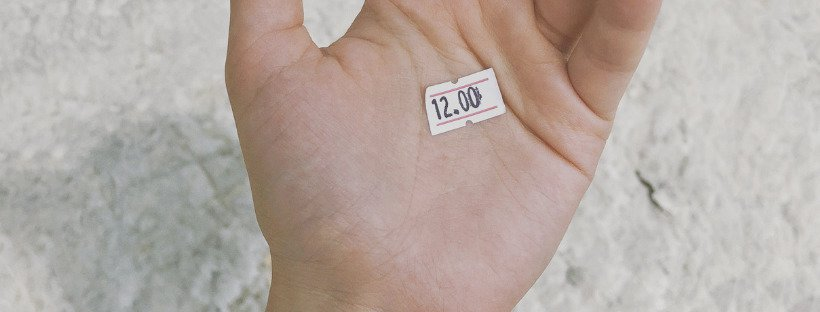

## And why it's not OK being watched.

So you are being watched online. Why should you care? After all, you are doing nothing wrong. You have nothing to hide, right? You just go online to chat with your friends, maybe argue with strangers, and life moves on! Should it really be a concern that the government and other parties are spying on you, gathering valuable information? That there are data aggregators building a nice (or not so nice 😅) profile of you to sell to the highest bidder? What of state agencies, travel companies, telecommunication giants, marketing agencies, advertising companies and insurance providers all clamoring for the personal data used not only to sell to you but sell you as well?

**Your privacy is a precious commodity.** You should care about your online conversations even if they’re just about making plans with your best friend or reassuring your mom you are eating right.

### 1)  Do you really think you have nothing to hide?

  * Would you be willing to hand over your phone and give me your PIN?
  * Would you be willing to let your postman open your mail and make a copy of it?

Do you still think you have nothing to hide? Be honest; It will be quite embarrassing even if you really _‘have nothing to hide’_ - simply because it’s your right to have your own space and self-freedom.

Strangely, if I replied, _“I do have things to hide”_, most people would stare at me and reply _“are you a terrorist?”_. Does it mean only terrorists have things to hide? Of course not. Everyone needs protection and privacy, no matter what the subject is about.

Maybe it’s because **we all have a different definition of our privacy?** Privacy is a hard concept to define, and it can not be reduced to a simple sentence or concept. For instance, the shortest definition I found online is: _“privacy is a state in which one is not observed or disturbed by other people”_. But, privacy is much more complex than just not being observed. It involves the right to personal space, the control over information, identity, intimacy… and other aspects of life!

> _“Privacy, in other words, involves so many things that it is impossible to reduce them all to one simple idea. And we need not do so.”_ --  Daniel J. Solove

Maybe it’s because **we all have a different definition of our personal information**. When someone declares he or she has nothing to hide, maybe it refers to the type of data the government typically collects? Even in this case, it’s inaccurate to declare I have nothing to hide. Why? Because no one is perfect, we are human beings, and human beings break the rules. Whether it’s hosting a poker night at home, not reporting those 20 dollars you found on the ground, or even jay-walking, we’ve all done something.

Maybe **it’s hard for people to identify that they are an object of surveillance**. Of course, you’re not going to receive a text message: _“hello we are spying on you in order to sell your data to your insurance company”_. When it comes to discrete actions: the less you see, the less you care.

Maybe **you do have something to hide, but you just aren’t aware**. If you live in the US, I am pretty sure that the federal government could find something you’ve done which violates a provision in the 27,000 pages of federal statutes or 10,000 administrative regulations - if they had access to every email you’ve ever written or every phone call you’ve ever made.

There are many reasons to care about your privacy in this age of online communication and data transfer. Here are some:

**Privacy is a right that has been fought for**. People in history fought for this, and it is important not to take privacy for granted. Even better is recognizing that there are countries under tyranny whose people have not yet attained this right to privacy. Like other rights, privacy is a right that has not always been around and therefore, like any other right it should be protected.

**There is a difference between privacy and secrecy**. When people say _‘they have nothing to hide’_ as the reason why they don’t care about privacy, what they are really doing is confusing privacy with secrecy. You may not want someone to actively read your emails, or read your messages, or scroll through your pictures. This is not because you have something to hide but because you want the right to have your private information private. It shouldn’t be any different when you hear of the government’s mass surveillance and laws and actions to curtail internet freedom and privacy.

**Your information will likely fall Into the wrong hands**. While you may feel like you don’t have anything to hide from government agencies for _‘security’_ purposes, you might be however alarmed to know that your information could fall into the hands of hackers, blackmailers, data aggregators and others who may be hell-bent on exploiting this data. Remember Equifax, Ashley Madison and Yahoo breaches? Being blasé about your privacy could mean courting trouble.

**There is uncertainty how the information you share now will evolve in the future**. Your private communication and information exposed to the world in an out-of-context manner can also be used against you. While you currently may not have a lot to risk if your data is shared, this can change in the future where your personal data can be misrepresented to the detriment of your career or social life. Politicians are constantly bombarded with their personal information exploited, speeches manipulated, and pictures were taken out of context.

### 2) How much is your data?

When you put tons of personal information online using Twitter, Facebook, Instagram, you have an instant benefit; it’s easy to use and free. So, it’s pretty tricky to balance with something that might be dangerous in a hard to predict future. But, those services aren’t entirely free, we're paying with our data, after all.

Do you wonder what tech companies and telecommunication giants gain from allowing you to transfer or store unlimited data in their servers for free? Are they philanthropists? No, they are not, they are the wealthiest companies on earth. Google is not a search company; it's a data company. The lack of privacy enriches corporations.

> _‘If You Have Something You Don’t Want Anyone To Know, Maybe You Shouldn’t Be Doing It’_ - Eric Schmidt, Google CEO

This is because if you’re not paying for it, you become the product. Or rather, your _‘private’_ information is. It is sold to interested parties such as advertising companies without your say-so. Thus gaining these companies riches and a reluctance to enforce privacy. You should, therefore, be very concerned!

### 3) Why is being spied on not ok?
")

I still wonder why we came to this _“nothing to hide / I do not care about my privacy”_ argument. An interesting theory called _“[The Internet's Original Sin](https://www.theatlantic.com/technology/archive/2014/08/advertising-is-the-internets-original-sin/376041/)”_ argue that people want to use internet for free so corporate companies start to experiment to make money using the data they had collected on the users and realized that was quite valuable in the context of advertising. Later on, governments find out that those companies have all the data they needed and start collecting them.

> _“Ask yourself: at every point in history, who suffers the most from unjustified surveillance? It is not the privileged, but the vulnerable. Surveillance is not about safety, it’s about power. It’s about control.”_ - Ed Snowden

Authorities made this acceptable and normal to most of us. How have they done this? They used the scapegoat of stopping terrorism or other illegal stuff.  But, are we all terrorists? Terrorists didn’t wait for the government to cipher their messages. So why is it so legitimate to spy on honest citizens? To my humble opinion, the goal is right, but the method is wrong - and it’s too asymmetrical.

### 4- Conclusion

So, why **it’s so important to care about our privacy** when you aren’t a nonconformist? Naturally, because it’s part of our freedom. If we start to trim our privacy little by little, it will lead undeniably to a massive loss of our freedom. Mass surveillance and the reduction of our privacy is made to have a certain degree of social control - to turn individual to perfect subject of control and control has no limit except the one we accept. Is it the type of digital environment that we want?

If you have time (1h30), I recommend that you watch this wonderful online documentary: **[Nothing to hide](https://vimeo.com/189016018)**



Cheers Internet, feel free to clap & follow our stories, see you next time. 🤫



📷: Adapted from [Nathaniel Dahan](https://unsplash.com/photos/16pOau3hBMY)
