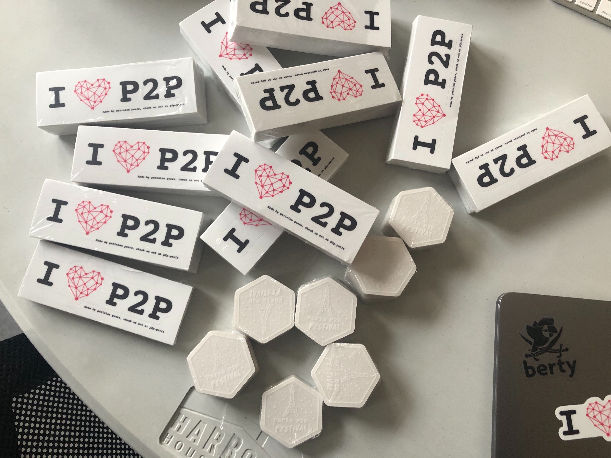

# Meet us at Paris P2P Festival!

[Paris P2P](https://p2p.paris/en/) is an open community of people interested in peer-to-peer technologies and cryptography. Berty is one of the co-founders. Monthly meetups are organized in Paris, the community already has branches in other cities, and now in a mutual effort we’re organizing the first [Paris P2P festival](https://p2p.paris/en/event/festival-0/), to which you’re all invited. It will take place on January 8-12, 2020.

We’re at the last steps of the preparation!

We’ll be giving talks at the festival:

* *Mainstream Introduction to the Berty Protocol*, by Manfred Touron
* *Introduction to IPFS and Berty Protocol*, by Antoine Eddi
* *How to Join and Contribute to Open Source Projects*, by Manfred Touron

See [full agenda here](https://p2p.paris/en/event/festival-0/#schedule).

The thing we love about these meetups is getting to know some cool people. We’re looking forward to meeting our friends and new interesting folks at the event. Join us to meet the Berty team, discover some exciting new projects and people, and have fun!

See you at the festival on January 8-12, at Ground Control, Paris.

 
