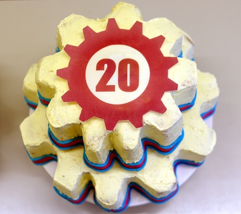
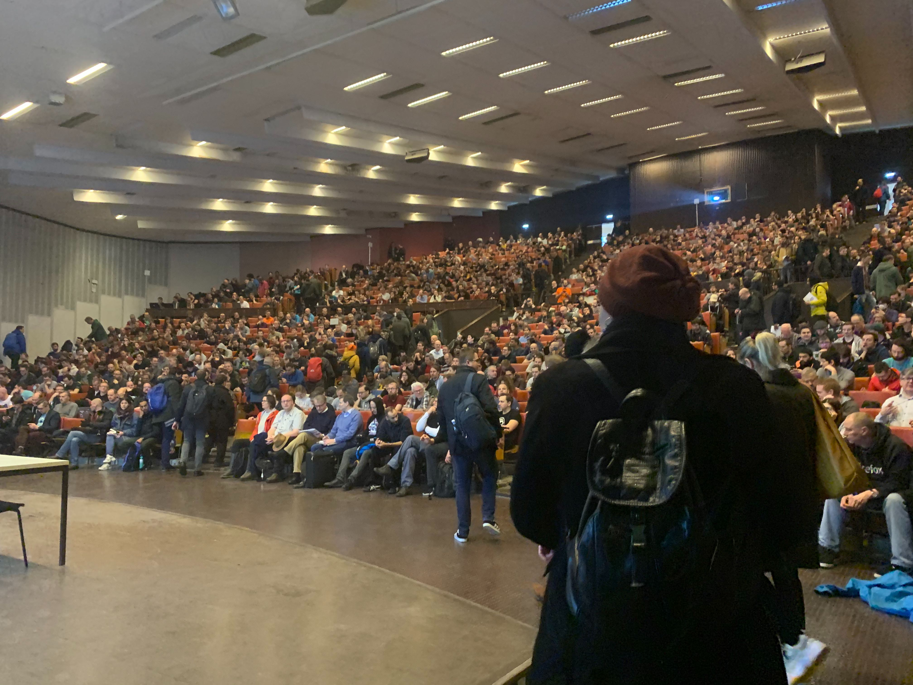
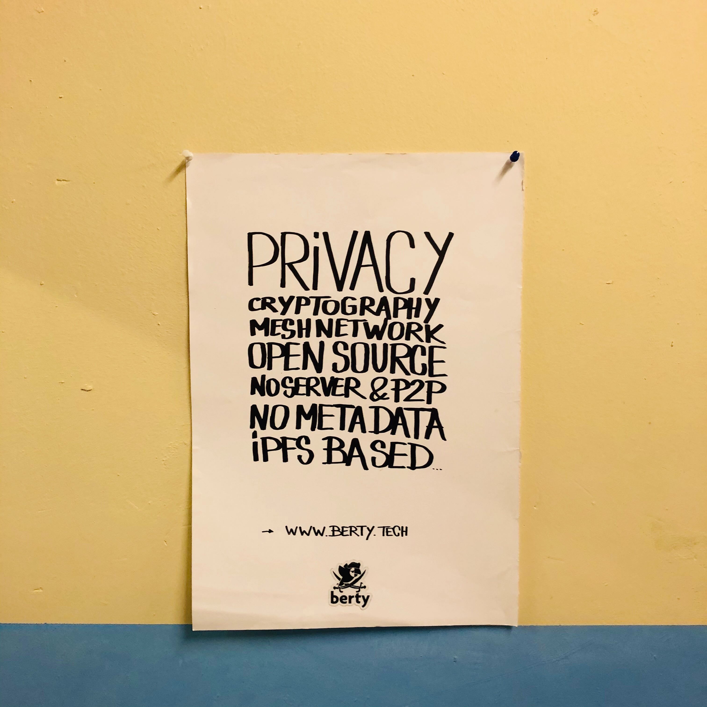
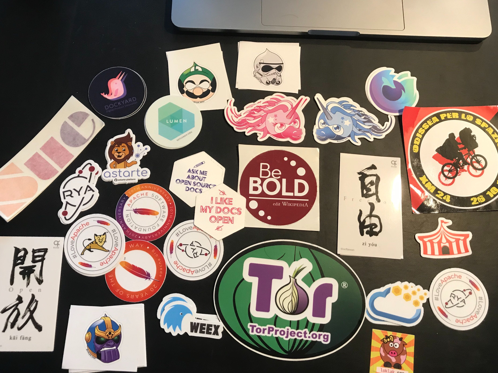

# Berty at FOSDEM 2020



  

Berty was at FOSDEM! For those not familiar with [FOSDEM](https://fosdem.org/2020/), it's a completely free event that allows software developers to meet, share ideas and collaborate.

FOSDEM was originally a gathering of open source hackers, and now it's one of the largest open source community events. This year was the twentieth edition. Every year, thousands of free and open source software developers from all over the world come together at this event in Brussels, and it's super cool! 

As announced in our previous blog [article](https://berty.tech/blog/berty-at-fosdem-2020/), we decided to join this event this year, and it was totally worth it! 🤩

## Our journey to FOSDEM

### Friday
We left on Friday afternoon from Paris, the day before FOSDEM, toward  Brussels by Thalys train. Super fast.

We had booked an Airbnb a few months ago, in the centre of the city to be able to go out in the evening, but still close enough to the tram line that leads directly to FOSDEM, which took place at the [Free University of Brussels (ULB)](https://www.ulb.be/). Looking back, it was a pretty good strategic choice. We recommend you to do the same. A lot of things happens in the city in the evening/at night: eating Belgian fries, waffles, and drinking beer at the Delirium bar...

So for us, Friday night was all about getting in touch  with friends... and, of course, enjoying a few beers together. 🍻

### Saturday Morning
On Saturday morning we went to the opening ceremony. The amphitheatre was just FULL - despite the 1500 seats and the retransmission. At that moment, we realized that there are a lot of participants. We mean... a lot.  It's hard to know exactly because there are no tickets and the event is completely free.  Rumors says there were between 8,000 and 10,000 participants.

Then, the team split into several independent groups. Each group was given the opportunity to listen to lectures on their topics of interest. It was easy to get lost, in a couple of ways:

* Get lost in the corridors of the university while trying to navigate to the next conference!
* Get lost in terms of content. It's just crazy: this year, there were 420 hours of conferences/workshop/rooms for 48 hours of congress, 835 lectures. It's pure madness! 🤯

### Saturday Afternoon/Night
We attended a lot of lectures (see the list below) and left the convention around 6:00 pm to have a nap and take a shower at our house before going to a party. Oh, we didn't mention there's an unofficial '[byte night](https://hsbxl.be/events/byteweek/2020/bytenight/)' party. 🎉

After eating a Flemish Stew (a typical dish made of beef and beer) in town, we went to this party near the train station. We met friends and some people we had already seen at [Paris P2P](https://p2p.paris/) and from [IPFS Camp 2019](https://github.com/ipfs/camp). It's a small world!

We saw a poster that said to follow the white rabbit 🐇. At Berty's, we like challenges, so we did it. We ended up in a hackerspace. It was really amazing and the people were super friendly.

### Sunday Morning
On Sunday morning, part of the team participated in a radio interview next to FOSDEM. *We will post it on our [Twitter](https://twitter.com/berty) when available, don't forget to suscribe.* 😇

The other part of the team went to the congress and literally squatted in the "Decentralized Internet and Privacy" devroom. Both space and time were packed. The only breaks we had was to get pasta from the food trucks set up in the middle of the university. 🤓

On Sunday afternoon, we kept listening to some lectures, but  had to leave just before the closing conference to go back to Paris.

This was pretty intense!

## Talks We Attended

- HTTP/3 for everyone, the next generation HTTP is coming by [Daniel Stenberg](https://daniel.haxx.se/)
- The Ethics Behind Your IoT by [Molly de Blanc](http://deblanc.net/blog/)
- State of Onion by [Tor](https://www.torproject.org/)
- The core values of software freedom by [Matthias Kirschner](https://fsfe.org/about/kirschner/)
- Making & Breaking the Matrix's E2E encryption by [Matrix](https://matrix.org/)
- Decentralized collaborative applications (Peer-to-peer collaboration, search & discovery) by [TJ x](https://fosdem.org/2020/schedule/speaker/tg_x/)
- Journalists are researchers like any others by the [Datashare's team](https://datashare.icij.org/)
- Making poetry with Racket by [Jerome Martin](http://rilouw.eu/)
- Peer-to-peer collaboration, search & discovery (Decentralized collaborative application platform) by [TJ x](https://fosdem.org/2020/schedule/speaker/tg_x/)
- An Introduction to the Tor Ecosystem for Developers by [Tor](https://www.torproject.org/)
- OpenPush (Introducing a Free, Decentralized Push Messaging Framework for Android) by [Marcus Hoffman](https://bubu1.eu)
- The Path to Peer-to-Peer Matrix  by [Matrix](https://matrix.org/)
- Building a Web App that Doesn’t Trust the Server (Securing ProtonMail) by [Daniel Huigens from ProtonMail](https://protonmail.com/)
- Technology challenges for privacy: the case of decentralized social media by [Cristina DeLisle](https://twitter.com/cristinadelisle)
- AMENDMENT Custom Crypto Policies by Examples by [Tomáš Mráz from Red Hat](http://people.redhat.com/tmraz/)
- Securing Existing Software using Formally Verified Libraries by [Tobias Reiher](https://fosdem.org/2020/schedule/speaker/tobias_reiher/)
- Wikibase Ecosystem by [Lydia Pintscher from Wikidata](https://www.wikidata.org/wiki/Wikidata:Main_Page)
- Empowering social scientists with web mining tools by [Guillaume Plique](https://medialab.sciencespo.fr/equipe/guillaume-plique/)

**FYI**: All talks were recorded if you want to have a look (https://fosdem.org/2020/schedule/)

We were thrilled to see that the topics we care about at Berty, such as P2P, decentralized network, privacy, encryption, open source are trendy topics.

## Our Tips For The FOSDEM

* Pack light for your trip, because you're going to be carrying your stuff on your last day.
* Find a hotel/Airbnb in the center, not far from the tram line.
* If you're a company, bring some stickers and your job offers.
* Wear comfortable shoes: Conferences are sometimes physically distant from each other and you have to run between the rooms. Don't worry if you have missed a lecture, they are recorded.
* Settle into a dev room with a topic you care: these theme rooms are a great idea because once you are settled in, you can stay for a long time and listen to talks about your topic of interest.
* Prepare your schedule the day before and check which conferences you want to attend. Bookmark them in the FOSDEM app.
* Plan to take cash: to buy coffee from the coffee machines, especially if you haven't slept much (and believe us, it's very likely to happen).
* Good to know: there are food trucks in the university, you don't have to go out. Of course, this includes traditionnal Belgian fries & waffles. By the way, most of them accept credit cards.
* Get your liver ready for several beers.

## Bye FOSDEM 2020, See You Next Year!

Fosdem is a super social event. It goes super fast. We would like to thank all the people we met, all the speakers and a big up to the organizers and the volunteers who made this event possible. Full respect: because we just recently co-organized [Paris P2P Festival #0](https://berty.tech/blog/berty-at-p2p-festival/), and we realize how much organization it requires. Thank you, you did an amazing job, keep it up!

See you next year at FOSDEM2021.

Proost Internet, voel je vrij om te klappen & onze verhalen te volgen, zie je de volgende keer. 🤫

 

