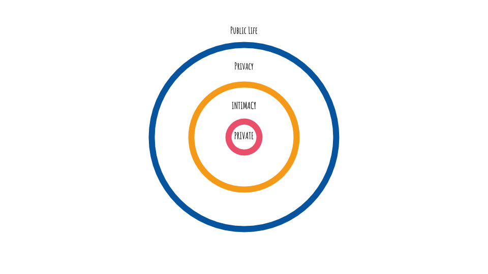

Security, safety, privacy, and intimacy are closely related terms. They respectively define very different specific nuances, and yet we regularly mix them up. This blog post will aim to study each of these terms and try to understand better how they may or may not associate with each other.

## 1) Sécurité
Security is a term to describe the **protection of individuals, property, and organizations against an external threat that could cause damage**. The purpose of security is, therefore, to ensure that external factors do not cause any prejudice or harm to an individual or his privacy. This can be considered as the mechanism put in place to guarantee security.

## 2) Safety
Safety is the feeling of being safe. It is one aspect, of **feeling protected from the factors that can harm us**. Security and feeling safe are complementary. Security refers to what can be considered as “the armor”, and feeling safe is the result of this “armor”. One is, therefore, the consequence of the other. But is it possible to not feel safe even when a security system is in place? In other words, does security automatically provide a sense of safety? For example, if one is watching the news about mass shootings and potential wars happening, would they feel safe even though their door is locked? Or if one finds out that their company is starting to do layoffs, even though they are physically in a secure building, the negative emotions certainly do not produce the feeling of safety. In summary, security does not automatically provide a sense of safety. Humans need physical security and emotional safety. On the other hand, if shelter and security aren’t provided first, the feeling of safety will never arise. These two terms are constantly correlated.

## 3) Privacy & Intimacy
Privacy defines the **boundary between the public and private spheres**. This barrier is intended to prevent the intrusion of the state or unwanted individuals into our daily lives. More specifically, privacy prevents intrusion with our family, friends, health, work, political ideas. Everything that surrounds our existence is a matter of privacy. In the private sphere, we also find what is called intimacy. Intimacy alone represents an undeniable paradox. It refers both to a great openness to the other (being intimate with someone) but also to the greatest closure to the rest of the world (my intimacy). Intimacy could be defined as an exclusionary relationship, a prohibited space in which only the person or persons with whom we share our intimacy can access. Therefore, intimacy with a person makes us give up our privacy — this space where we find ourselves with ourselves and not under the gaze of the other. We can consider intimacy as this secret garden that we all possess and defines our private space, an undeniably mysterious space for others.

## 4) Liberté
Individual freedom is an integral part of everyone’s private life. It stops where this **freedom would encroach on or hurt the freedom of others**. An invasion of privacy is defined as a violation of the right to privacy. Therefore, security is there to protect each other and ensure that everyone’s privacy is respected, for example, we lock our front door to be safe. If unfortunately, an individual manages to trespass into our space, it is then an offense, punishable by law. The latter is set up to respect and secure everyone’s life. Without this security, the world would be without any control, and would undoubtedly go into peril. However, there is no unanimity on this feeling of security, particularly about digital technology, and there is a problem. Since the expansion of terrorism, public security has intensified at the expense of “private” security. Surveillance is such that our private life is increasingly sacrificed, to such an extent that it can affect our intimacy, even worse, our privacy.

> _"Liberty requires security without intrusion, security plus privacy."_ --  Bruce Schneier

A votre santé Internet, n'hésitez pas à applaudir & suivre nos publications, à la prochaine. 🤫



&#x1F4F7; by [Lars_Nissen_Photoart](https://pixabay.com/fr/amour-rage-deuil-haine-%C3%A9vasion-2055960/)
