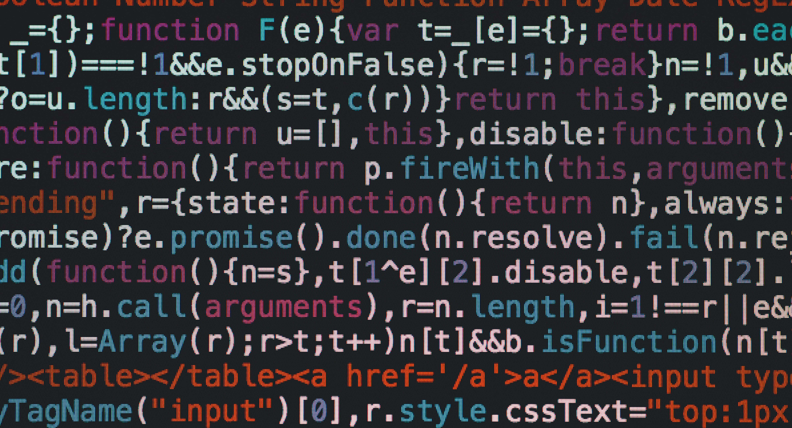

Open-source refers to the software whose source code is available for anybody to access and modify, while proprietary software refers to the software which is solely owned by the individual or publisher who developed it. And for once, we are happy to say that we have nothing to hide! 

🚀 **Benefits:**

- Benefit from shared expertise: anyone can contribute, verify, audit, or even reuse our work
- No license fees
- Allows the app to be installed without going through the official stores

🤨 **Cons:**

- None?

 💪 **Associated Challenges:**

- Find a way to get revenue: [https://berty.tech/challenges#funding-as-an-ngo](https://berty.tech/challenges#funding-as-an-ngo)

✨ **Going further:**

- Read our post announcing our code release: [https://berty.tech/blog/open-source/](https://berty.tech/blog/open-source/)