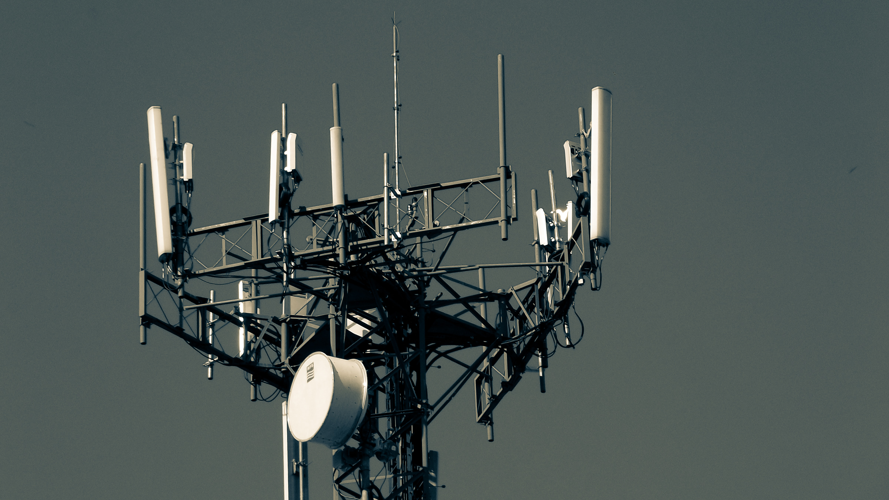

Berty was created to withstand extreme conditions and be bulletproof to the future. We designed Berty as if the application would work on Mars to mimic extreme network conditions and we came up with this crazy idea: what if there is no network available? We have to handle it. So, we develop a way to communicate without any internet connection, by using Bluetooth Low Energy (BLE) technology and mDNS.

🚀 **Benefits:**

- Communicate even without a SIM card
- Allows communication in areas with weak or no connection at all
- Creation of an autonomous local network if the internet is shut down whether intentionally or not.

🤨 **Cons:**

- None?

 💪 **Associated Challenges:**

- Interoperability between Android and iOS
- BLE limited performance
- Asynchronous communication (off grid communication)

**✨ Going further:**

- Read more about BLE: [https://berty.tech/blog/bluetooth-low-energy/](https://berty.tech/blog/bluetooth-low-energy/)