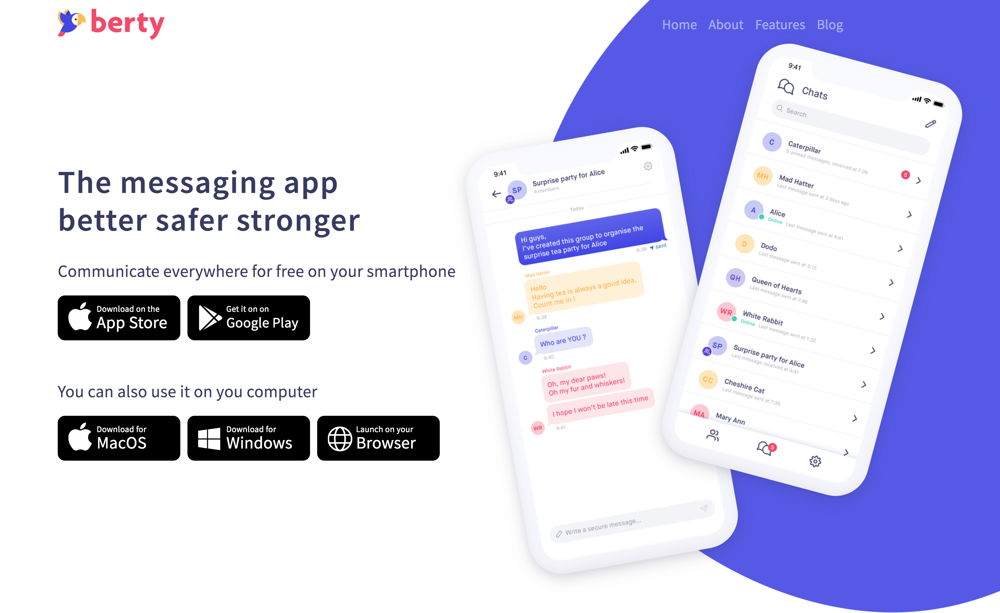
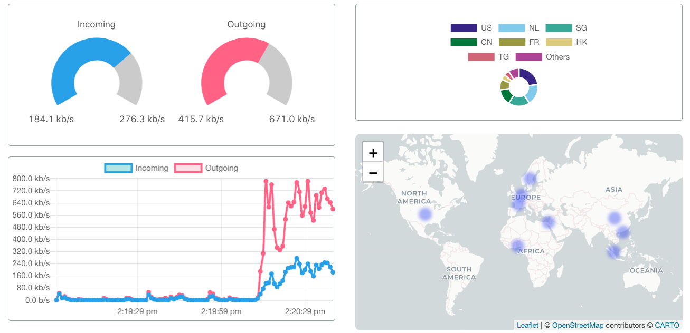
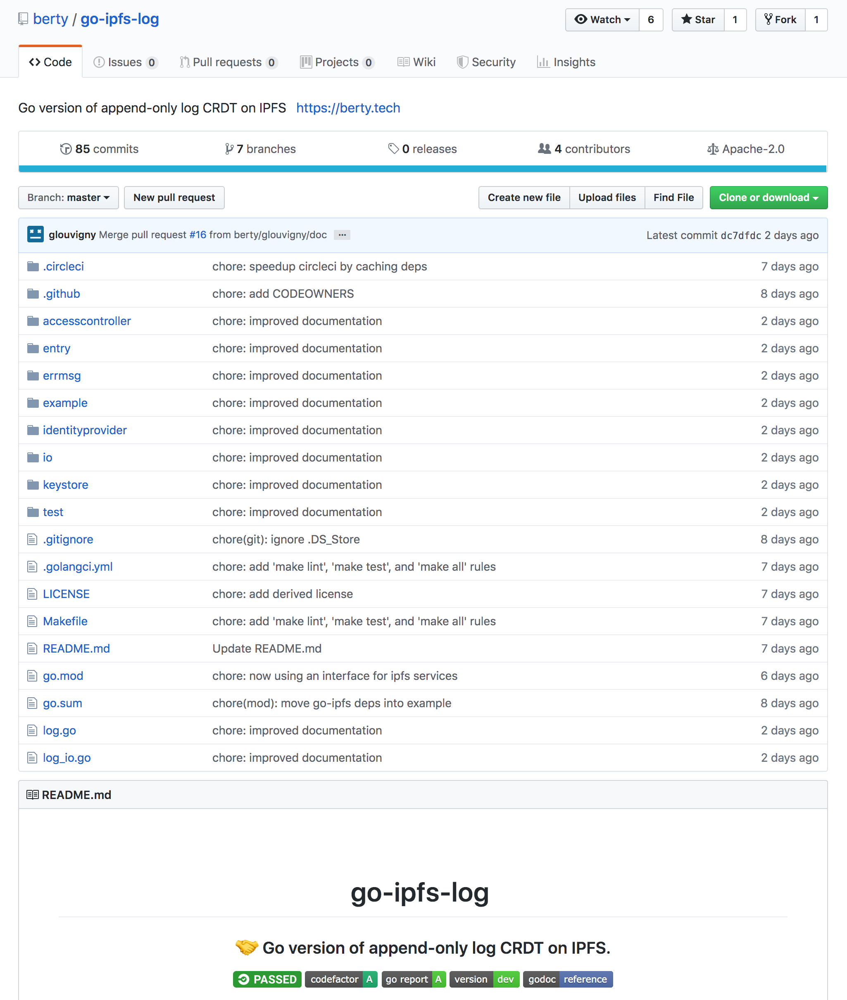

## Current Work

### Website

 We updated our website. It's still under construction. For the moment, you can see the overall structure and the first pages. You should definitely take a look! 👀 👉  [https://berty.tech/](https://berty.tech)

### Black Pearl

 The Black Pearl is actually a dashboard that allows us to visualize all our peers on a world map 🗺️. And of course, the statistics evolve in real time. It's great to see!

### And Currently

 We are working on the stability and efficiency of the network 💪. To do this, we are in the process of using the latest version of QUIC to benefit from the reuse port feature. We are also working on improving the management of connectivity changes (including the switch from 4G to wifi and vice versa) 🔌. We reworked the Bluetooth Low Energy (BLE) 🔋 which no longer worked due to the many changes on our code. We remain hopeful that we can have you tested next week! Finally, we are working on porting the ipfs-log lib from javascript to go! It's already open source: [https://github.com/berty/go-ipfs-log](https://github.com/berty/go-ipfs-log)

[> More info on our staff Team Weekly Sync!](https://github.com/berty/mgmt/blob/master/meeting-notes/2019/Q4/2019-10-04--staff-team-weekly-sync.md)
