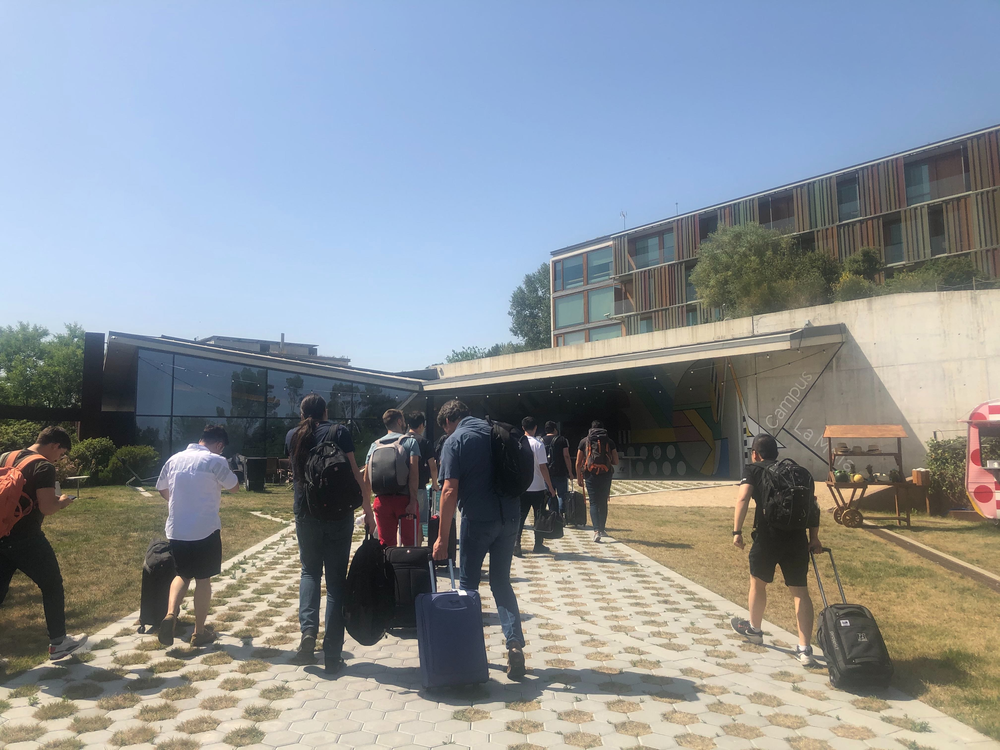
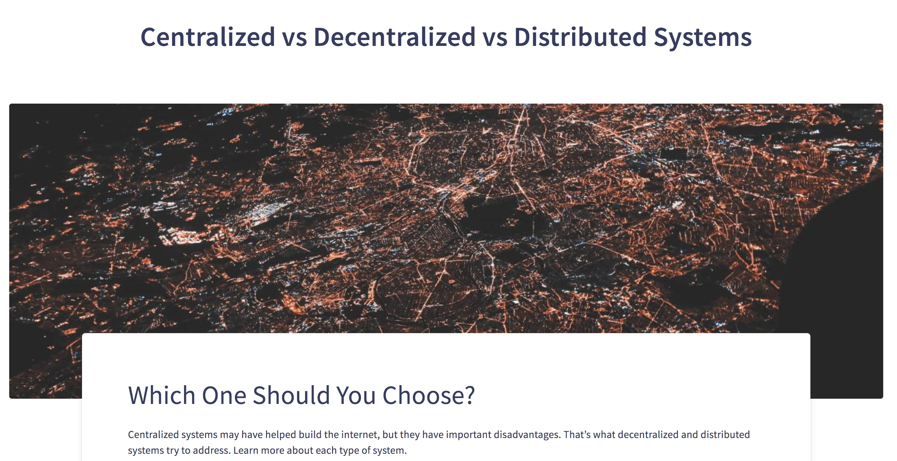
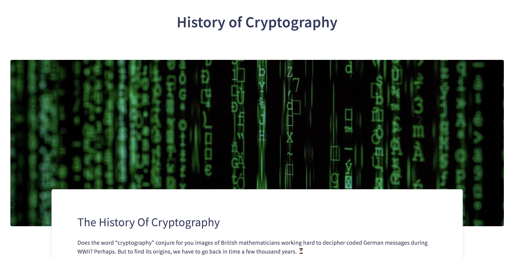

## IPFS CAMP

* Right now, our developers team is in Barcelona at IPFS_CAMP. This workshop brings together IPFS users and allows to share about the new usages of the decentralized Internet. Our team has been selected to present their work on the Bluetooth Low Energy (BLE) 🤞. #SOPROUD! We hope everything goes well for them. We promise we'll tell you more about it next week 😉.

## NEW BLOGPOST

* If you guy wanna know more about decentralized, distributed, and centralized system, you should definitely have a look at our latest blog post: [https://berty.tech/blog/decentralized-distributed-centralized/](https://berty.tech/blog/decentralized-distributed-centralized/) What do you think 🤔?
* 

* Refresh your memory on the history of cryptography here 👉 [https://berty.tech/blog/history-cryptology/](https://berty.tech/blog/history-cryptology/)
* 

## And Currently:

* We have updated (again) our website:  👉  https://berty.tech/
* We keep working on improving the management of connectivity changes (including switching from 4G to wifi and vice versa). Hope to fix this soon!

[> More info on our staff Team Weekly Sync!](https://github.com/berty/mgmt/blob/master/meeting-notes/2019/Q4/2019-10-04--staff-team-weekly-sync.md)
