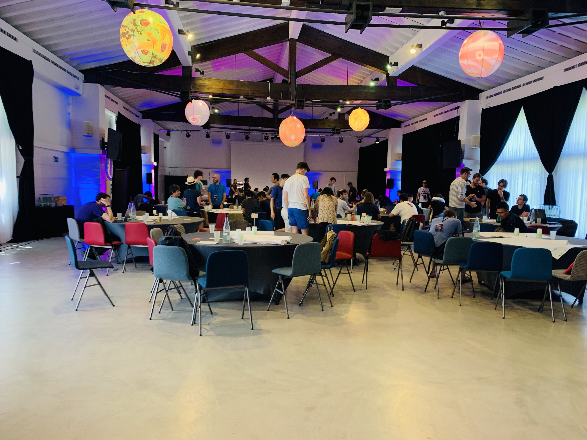
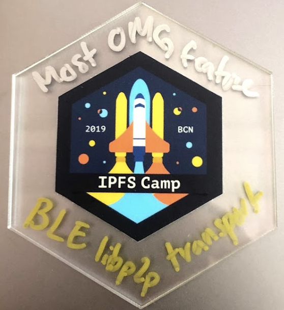
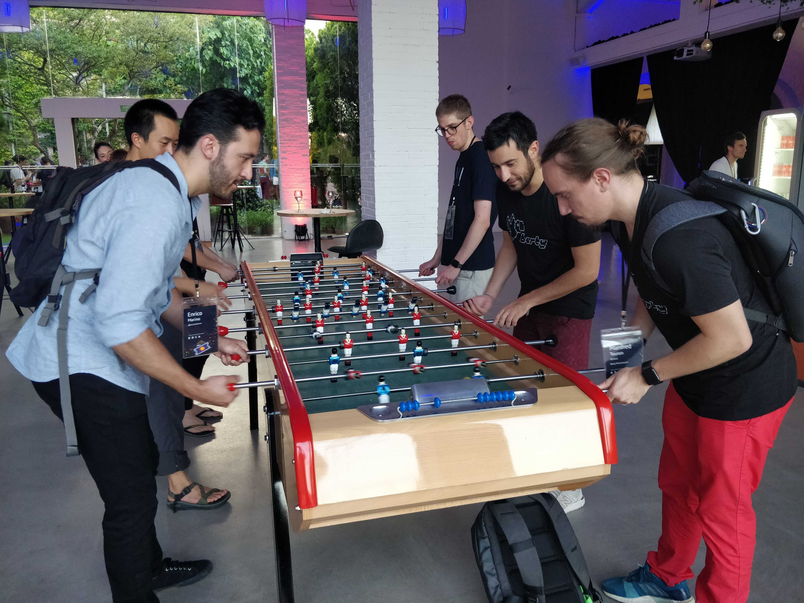
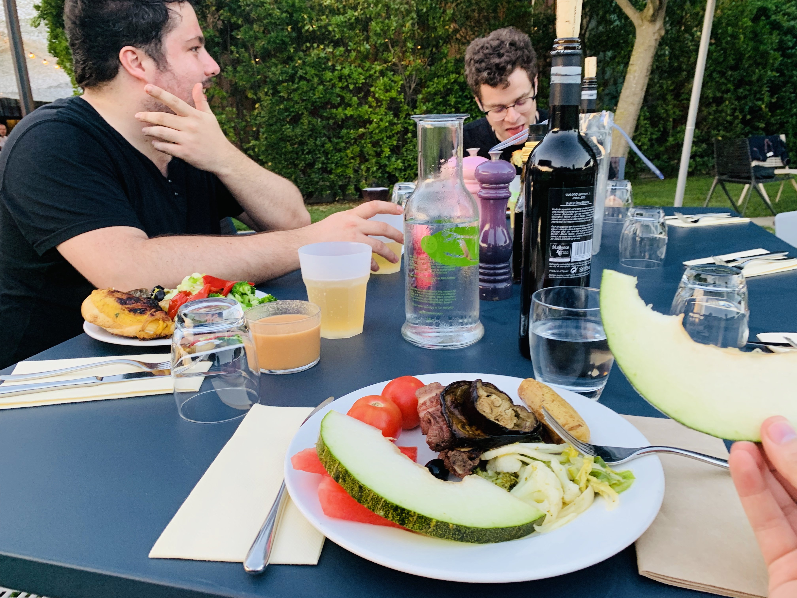
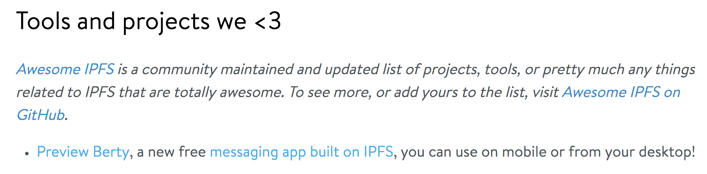
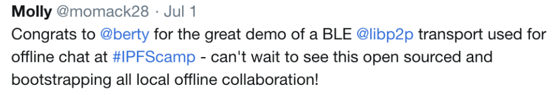

## Feedback from IPFS Camp

 As I mentionned in our previous newsletter, the Dev Team attended at IPFS Camp in Barcelona! During this stay, a lot of things has happened. Let's me tell you more:

### NEWS COLLABORATION

 Summits are always an opportunity to meet new teams and people. IPFS Camp was no exception. They met, in particular, the teams of Textile (for the mobile part) and Peergos (for the cryptography part on a distributed system). The entire Berty team is looking forward to work with them again and to see the incredible results we will achieve at the end! 😉

### MOST OMG FEATURE

 Our team get the "Most OMG Feature” award for our work on libp2p transport over Bluetooth Low Energy 🤘. This will be open-sourced pretty soon! In the meantime, you can register to the preview: [https://crpt.fyi/berty-preview](https://crpt.fyi/berty-preview)

### RELAX TIME

 Of course, they took the time to enjoy the place and the activities!

### THEY MENTIONNED BERTY**:

### OPEN ACCESS BERTY

 Soon we' ll be inviting people to our GitHub organization. We will provide preview access to certain parts of Berty (network, crypto, protocol, mobile bridge) depending on their profile: [https://github.com/berty/crew](https://github.com/berty/crew)

Many thanks to Protocol Labs for the outstanding organization of this camp in this wonderful place 😍!!!!

[> More info on our staff Team Weekly Sync!](https://github.com/berty/mgmt/blob/master/meeting-notes/2019/Q4/2019-10-04--staff-team-weekly-sync.md)
