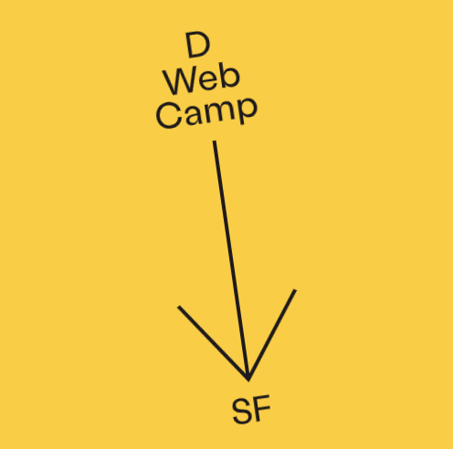

## NETWORK, BLE, GO MOBILE IPFS

The preview of our work on the network and Bluetooth Low Energy (BLE Transport) will be available next week. It’s currently under review before officially open-sourcing it. For those who are interested, you can register to have access to the preview version: [https://crpt.fyi/berty-preview](https://crpt.fyi/berty-preview).

Great news: We are currently reworking go mobile-IPFS repo with Textile team to release publicly ASAP. Our top goal is to give an insight/first guidelines on how to integrate IPFS using Gomobile. Keep you informed when it's ready!

## RELAY MOBX

The tech team has simplified the way to recover data from the graphical interface of the app switching GraphQL and Relay to MobX. Since then, we have gained performance and simplicity!

## DWEB CAMP DEMO

DWeb Camp: We were really excited about DWeb Camp in San Francisco. Unfortunately, we can't attend it this time. If you're going there, just to let you know: Some folks from IPFS and Textile will be there and some of them have Berty installed on their phone. Ask them for a demo of Berty's Bluetooth P2P!

## OSMOSE HACKATHON

The Berty team will participate to the Osmose Hackathon this weekend.

One of the events of this hackathon will be a brainstorm about how Berty and the Blockchain ecosystem can work together, including finding incentives for Berty relays or integrating the Berty Protocol as the network foundation of new offline-first blockchains.

## p2p.paris

We are launching Paris P2P, a news meetup for P2P enthusiasts in Paris!

Those events will aim to discuss various topics related to P2P such as distributed systems, decentralized systems, offline-first app, mesh networks, privacy, anti-surveillance, anti-censorship, security, cryptography and blockchains.

This meet-up also aims to bring us closer to the communities active in this sector: Cryptosmose, IPFS, CryptoFR, ProtoSchool, ZeroKnowledge,...

We will be happy to have you there. You can already join the group on Meetup: https://p2p.paris/.

We will give you more information about the organization of Paris P2P very soon.

[> More info on our staff Team Weekly Sync!](https://github.com/berty/mgmt/blob/master/meeting-notes/2019/Q4/2019-10-04--staff-team-weekly-sync.md)
