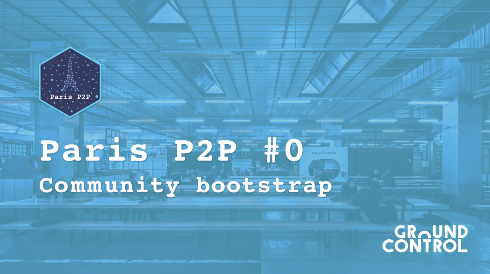

## Paris P2P #0 🇫🇷

As announced in our previous newsletter, we are participating at Paris P2P, a series of meetings for P2P enthusiasts in Paris! AND the first event is launched!

Edition #0:   📅 Wednesday, August 7, 2019   📠Ground Control (Gare de Lyon - 81 rue du Charolais - 75012 Paris).   🕕 Start at 6:30 pm   â„¹ï¸ RSVP   âœ‰ï¸ bootstrap@p2p.paris  

The Paris P2P meetings will take place every first Wednesday of each month in Paris. Get more info about Paris P2P meetup series: https://p2p.paris

We are delighted to participate in these meetings! This is a great opportunity to meet and talk with passionate folks! We hope to see you there!

➡️ Feel free to send your suggestions/next topics here:  http://crpt.fyi/parisp2p-cfp

## WORK IN PROGRESS

This week, the tech team is still working hard on the Network. That explained why Berty's preview version only works in local for now. We hope to fix that asap!

We are working on a new design for the app 🤫 Stay tuned!

The Ops team finished working on the Cryptography Exports! Next step is to be reviewed by a lawyer. We hope to submit this application before August.

We participated in OSMOSE hackathon last weekend. We spoke a lot about synergies between Berty and other organizations. Hot stuff coming, but we can't tell you more yet!

## They talk about us:
https://peergos.org/blog#ipfs_camp_new_features_july_2019

[> More info on our staff Team Weekly Sync!](https://github.com/berty/mgmt/blob/master/meeting-notes/2019/Q4/2019-10-04--staff-team-weekly-sync.md)
