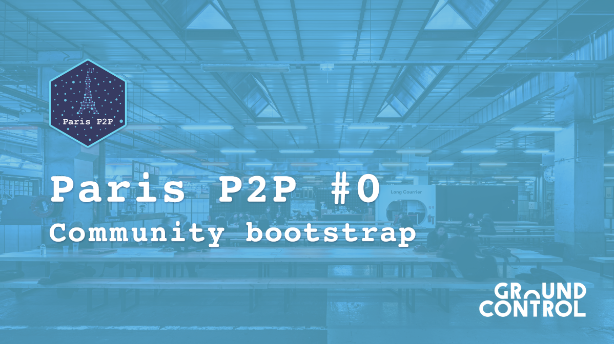

## Work In Progress

Even if Paris saw a record high temperature of 42.6C (108.7F) on Thursday ♨️, amid a heatwave that broke records across Western Europe, we did some great stuff: We focused a lot this week on our identity and uniqueness. Two keynotes and a lot of workshops and we finally agreed on a new universe! The operations team is now working on how to display it in the app & on all our communication material. We hope that you’ll like it!

Sadly, we still face some network issues. It took a certain amount of time before we found out what’s going on. So for now, Berty’s preview version only works locally. The technical team is working hard on fixing it! We are sorry for this inconvenience.

As we mentioned last week, our UX/UI designer, Alex, worked on the V2 of the app. It’s not done yet, but it’s on the good way ! We can’t wait to show you more soon!

## We need you!

Yes, buddy, we need you! We are looking for security experts who could help us move forward! We're looking for people who can perform an audit of our protocol. Maybe, you know people or companies that have the ability to audit the Berty protocol. If so, can you introduce us or give us their contact details? It would help us a lot!

## A quick reminder

For our french friends 🇫🇷: we will be at Paris P2P Edition #0! We look forward to seeing you there!

📅 August 7th, 2019   📍 Ground Control (Paris)   ✉️ bootstrap@p2p.paris   ➡️ More info: https://p2p.paris/  

If you can't attend, no worries, there are more events to come 😉!

[> More info on our staff Team Weekly Sync!](https://github.com/berty/mgmt/blob/master/meeting-notes/2019/Q4/2019-10-04--staff-team-weekly-sync.md)
