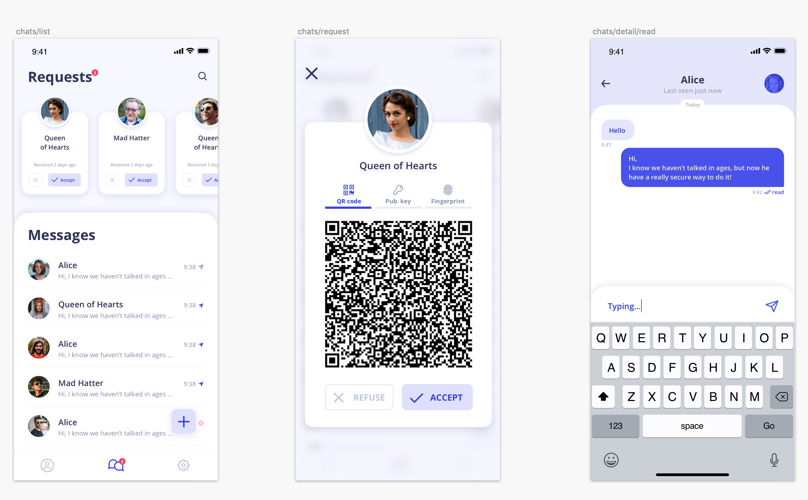

## Protocol architecture

Our team did a three-day architecture session to define the in-detail structure of the Berty protocol v1. This protocol will be released as a SDK so that developers will be able to benefit from our work to simply create secure DApps on top of IPFS. Stay tuned, more info coming soon!

## The V2 of Berty's mobile-app

Our UX / UI designer, Alex, has completed Berty's V2 mobile apps mockups on Sketch 🎉. Here is a small sneak peek:

## Oye! Oye!

We are actively looking for a React Native Developer, if you are interested, you're welcome to get in touch for a potential collaboration. For more information about the job, check out this ad 👉https://berty.tech/jobs/react-native-developer/.

## Work in progress

* Preparing the first Paris P2P event for next week
* The Ops team took care of filling out the initial version of the ANSSI regulatory form for Cryptography export
* BLE: we started refactoring multiaddr and PeerID characteristics
* Go-orbit-db's first replication test is now working!
* Added UI integration tests + CI speed-up
* Gomobile was broken when used in local development on OS X
* Removed a crash when the "Contact Add" button was pressed on the onboarding screen
* Conversation List header was missing
* Fixed a WSOD that occured under certains circumnstances

## A quick reminder

For our french friends 🇫🇷: we will be at Paris P2P Edition #0! We look forward to seeing you there!

📅 August 7th, 2019   📠Ground Control (Paris)   âœ‰ï¸ bootstrap@p2p.paris   â¡ï¸ More info: https://p2p.paris/en/  

[> More info on our staff Team Weekly Sync!](https://github.com/berty/mgmt/blob/master/meeting-notes/2019/Q4/2019-10-04--staff-team-weekly-sync.md)
