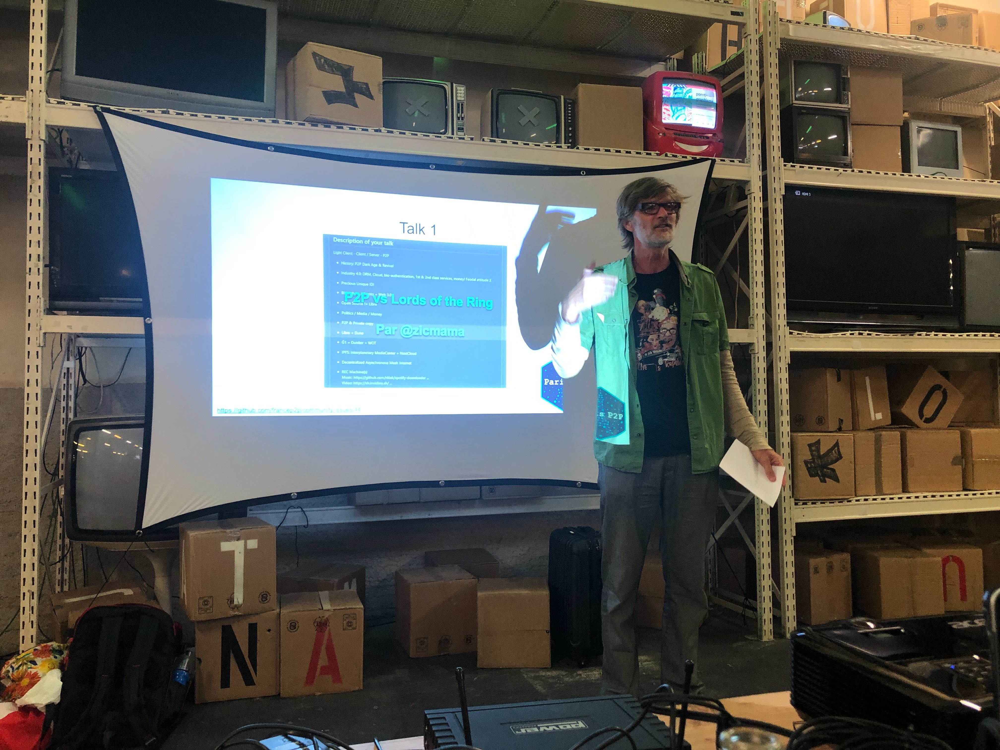
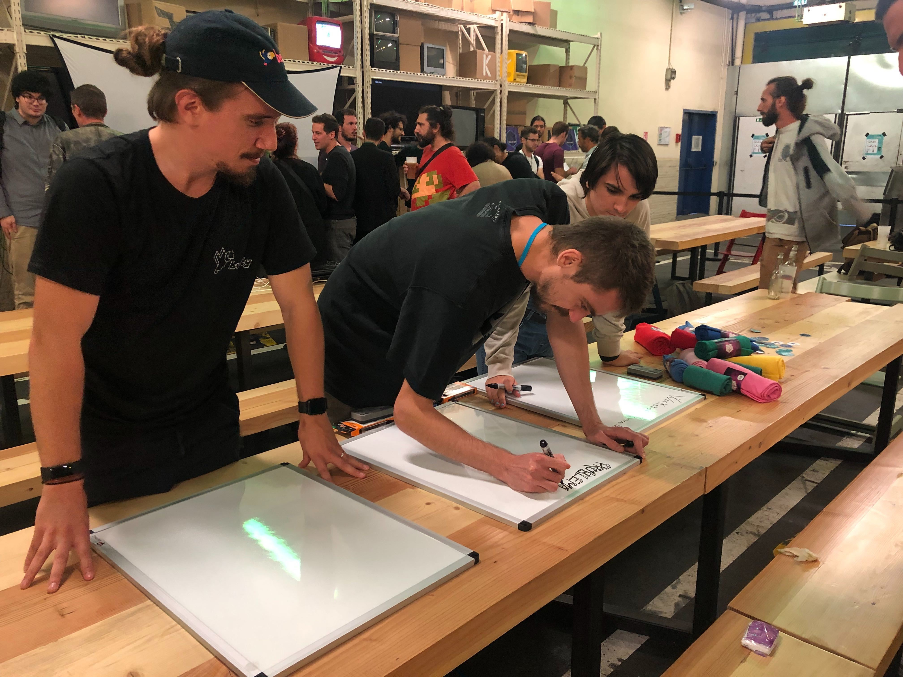

## Huidig werk

First of all, you can update your version of Berty via Yolo. Our update platform has just been repaired. Sorry for the inconvenience.

* Yolo (Android)
* Yolo (iOS)

So, in a nutshell, the main topics of this week were:

* Cryptography-export declaration: Sent! We are waiting for feedbacks or accordance! May the god of crypto be with us 🎉 Live testing: We started our weekly user acceptance tests. Basically, three of us take an android phone, an iPhone and a computer and do the same exact tasks like adding a contact, deleting a group conversation, sending messages in plane mode, changing settings... We found some new bugs, we have works to do!
* Bluetooth Low Energy (BLE): We are still working on iOS/Android compatibility. This is our big project. It takes time to do it well. We hope to progress quickly. We'll keep you informed!
* Push Notification: We're still working on push notifications (can be useful in a messenger app). This is an important challenge, especially when respecting the zero-knowledge. We started to open-source the 'zero push'. We're still doing a little cleaning in the code and we'll share it with you soon!

## Paris P2P #1

Paris P2P #1 took place last Wednesday, we had a blast! We talked about free internet, web3, IPFS, and much more stuff around a fresh draft beer 🍺🍕. Guys, if you're around next time, you should definitely join us! Just saying 🙃

## We're (still) hiring!

We are still looking for the coolest React Native developer to work on Berty! We are convinced that the talent we are looking for is someone you know. We will be so grateful if you share that info, and tell your friends about this amazing opportunity!

Help us find the right person 👉 https://berty.tech/jobs/react-native-developer/

## Vacation time!

All Berty team will not be here next week, because berty has annual vacation.

 Don't worry if we don't give you too much news, we'll probably be under the sun ...  thinking of you 😇

We'll be in touch again on September 16th by email and in two weeks for our weekly newsletter - which we know you're looking forward to!

[> More info on our staff Team Weekly Sync!](https://github.com/berty/mgmt/blob/master/meeting-notes/2019/Q4/2019-10-04--staff-team-weekly-sync.md)
