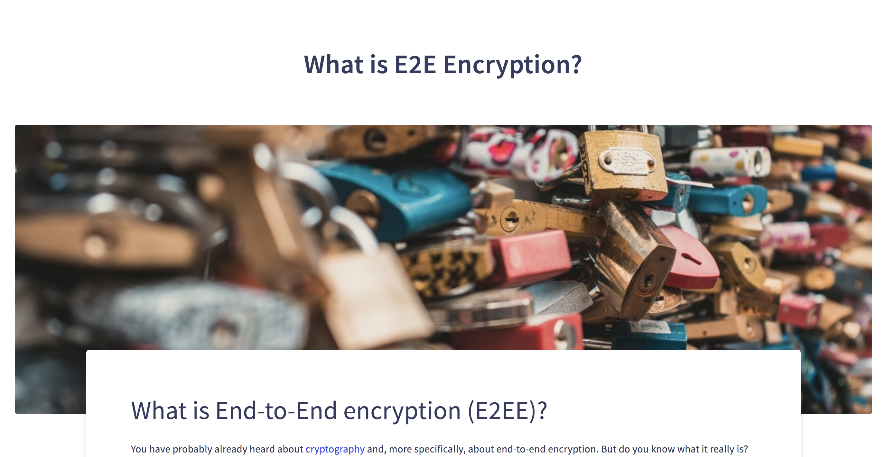

## Huidig werk

After a week of our annual closure: we are back to work 💪 We have a couple of nice news to share with you:

* **V2 Berty**: We've already been talking about it in our several newsletters and so you know that we started the V2 of the application. We already worked on the new interfaces, new crypto and a brand new Berty protocol. AND we are so pleased to say that we have officially started the implementation.  #bereadyforv2  🎉
* **Gomobile-ipfs**: The first version of the repo is now complete. We will transfer the repository to the IPFS organization after having reviewed it! 💯 🎉
* **Be Public**: This week, the whole team brainstormed on a launch strategy on social networks, the press and how to make Berty known to as many people as possible. If you also have ideas, you can tell us by replying directly to this email, or on twitter. We are interested in all the good ideas (and we know you have some)!

> [More info on our staff Team Weekly Sync!](https://github.com/berty/mgmt/blob/master/meeting-notes/2019/Q3/2019-09-20--staff-team-weekly-sync.md)

## New Blogpost

This week, we published our article on End-to-end encryption.

Check this 👉 [What is E2E Encryption?](https://berty.tech/blog/e2e-encryption/)

<!--\--> 
 

## React Native Developer

As a reminder, we are still looking for a great React Native developer to work with us! Thank you for sharing this information with others!

Help us find the right person 👉 https://berty.tech/jobs/react-native-developer/
