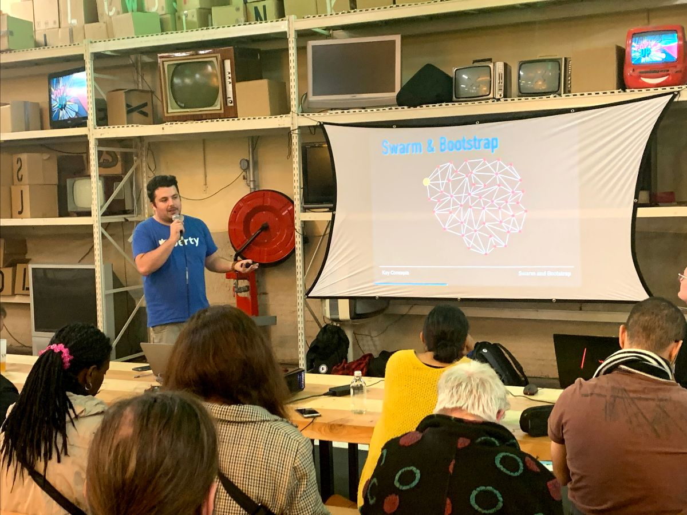

## Current Work

* **V2**: The intermediate layer between the front and the protocol is currently being developed. This layer is called "**Berty Chat**".
* **Crypto**: We started to work on groups communications and handshakes.
* **Gomobile-ipfs**: We continued working on gomobile-ipfs. We try to do the setup of a local webui for gomobile-ipfs.
* **Berty's protocol**: This week, we have started to configure the standard code and project layout to support the new protocol.
* **Be Public**: We continue to work on the press kit and the launch strategy and email launch strategy and worked on a new communication ploy for the Ops team.

[> More info on our staff Team Weekly Sync!](https://github.com/berty/mgmt/blob/master/meeting-notes/2019/Q4/2019-10-04--staff-team-weekly-sync.md)

## Paris P2P #2

This Wednesday, we participated in the **2nd edition of Paris P2P** and the topics presented are still as interesting as ever. Antoine did a talk about **IPFS**. Our friend Zooma made a poster session on **DPOS**.

We are delighted to see that more and more of us are meeting at these monthly events, and if you're around next time, you should definitely join us!

➡️ Join the community on [Matrix](https://riot.im/app/#/room/!gcnyCpTSlGiqqwphSu:matrix.org) or [Discord](https://crpt.fyi/parisp2p-discord).

## React Native Developer

As a reminder, we are still looking for a great React Native developer to work with us! Thank you for sharing this information with others!

Help us find the right person 👉 https://berty.tech/jobs/react-native-developer/
