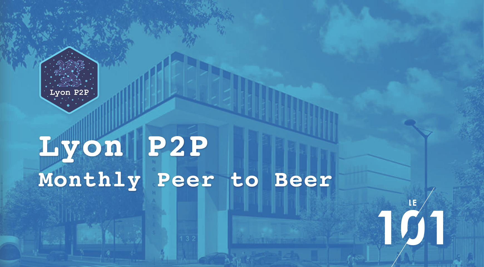
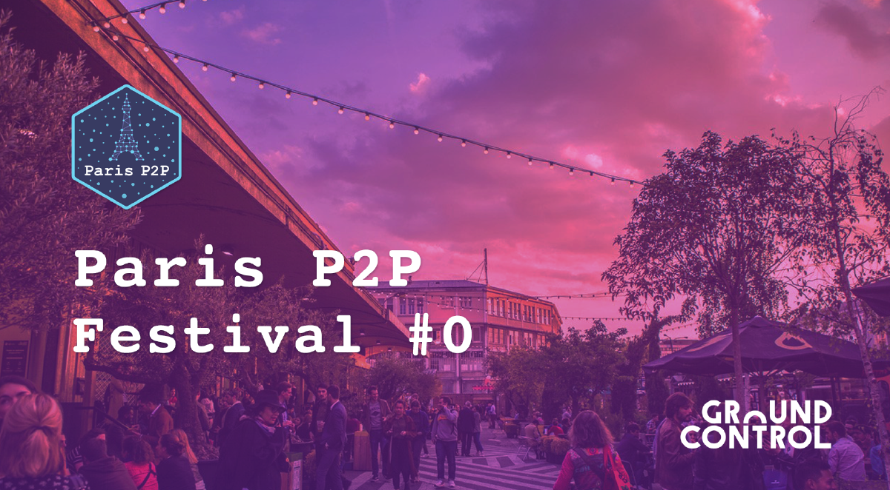
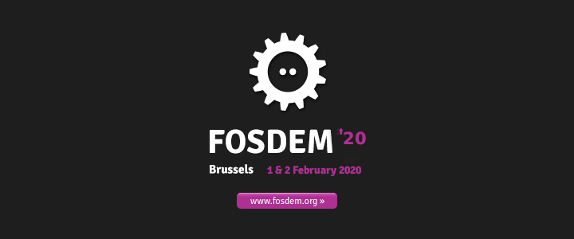

*A quick message: We would like to sincerely THANK YOU because we get a lot of feedback and new suscribers to our weekly newsletter. So, welcome to the new ones and thank you all for following our wild adventure!*

# Current Work

## Tech:

### Gomobile-ipfs
Antoine and Guilhem implemented a basic Unix domain socket system that will be used for gomobile-ipfs shell access (the node will serve its API over UDS) and for the arbitrary peer dialing feature.

Guilhem also fixed gomobile-ipfs shell on the iOS simulator, where the absolute path was too long to use a shell over UDS, so we had to fall back on TCP. The thing is, a socket path length is limited to [108 chars](https://unix.stackexchange.com/questions/367008/why-is-socket-path-length-limited-to-a-hundred-chars) and the temporary directory absolute path on the iOS simulator looks like this:

<code>/Users/aeddi/Library/Developer/CoreSimulator/Devices/DD757A2D-73E4-42FE-A652-482F314DC0C3/data/Containers/Data/Application/34589FE1-0BA9-44FC-9954-57CCB7D9F884/tmp/</code>

### First build
This week, our front team was busy working on the first build of the app:
-  Godefroy fixed Berty’s Android and iOS build targets #whoopwhoop
-  Clément finished implementing the main screens!
-  Norman is porting the CI to buildkite. He still needs to write the Linux setup scripts

We hope to show it to you soon! 💪

## Ops:

### Audits
In our previous newsletter, we mentioned that we were looking for people who could contribute to our audit of Berty. We really thank you for your replies 🧡.

We'll contact the people you recommended! We'll keep you informed.

### Berty Protocol
Manfred, our founder, released the *bertyprotocol.proto*. You can have a look here:

> https://berty.tech/docs/protocol/#bertyprotocol-proto

### New article on the blog!
This week, we published a new blog post on why smartphones are the best surveillance devices ever made. Happy reading!

> https://berty.tech/blog/smartphone-surveillance/

### FOSDEM 2020 🇧🇪
Fresh news: we will be attending the FOSDEM 2020 convention.  Every year, thousands of free and open-source software developers from all over the world meet in Brussels. We'll be happy to meet you there in February.

If you come, drop us a message so we can enjoy a local brew together. 🍻

> https://fosdem.org/2020/

### A quick sumup about where we can meet:
- Dec 4th - Paris, France 🇫🇷: [Paris P2P #4](https://p2p.paris/en/event/monthly-4/)

- Dec 11th - Lyon, France 🇫🇷: [Lyon P2P #1](https://www.meetup.com/fr-FR/France-P2P/events/266104402/)

- Jan 08th to Jan 12th - Paris, France 🇫🇷: [Paris P2P Festival](https://p2p.paris/en/event/festival-0/)

- 1 & 2 February - Brussels, Belgium 🇧🇪: [FOSDEM 2020](https://fosdem.org/2020/)

## Weekly Sync

Read our [Weekly Sync](https://github.com/berty/mgmt/blob/master/meeting-notes/2019/Q4/2019-11-22--staff-team-weekly-sync.md)
