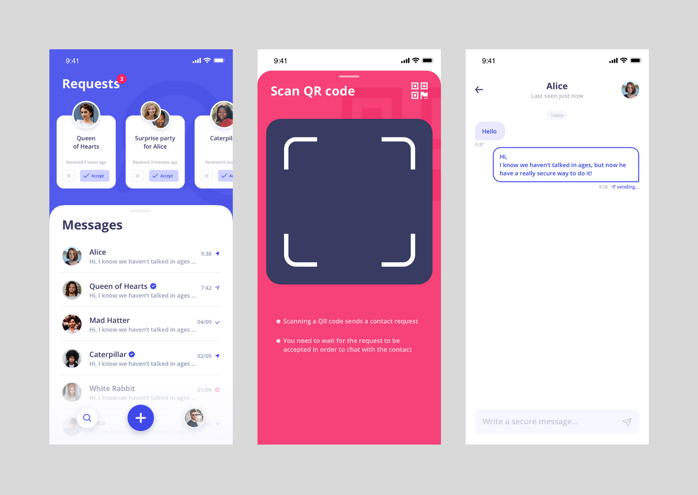

Hello dear friends from all over the globe 🧤 We hope you are doing well and that you had a good thanksgiving! 🦃🍁 Happy reading!

# Current Work

## Tech:

### It's gonna be...wait for it!
We have an exciting announcement for you next Friday. We wouldn't want to spoil this surprise too early so we opted to wait till next week. Stay tuned 🙊

Do you have any idea what that could be?

## Ops:

### The V2 of Berty's mobile app
A few months ago, we demonstrated you some screenshots of Berty's V2, made by Alex, our UX / UI designer.

And because it's you, a little padawan who follows our news, here's a little glimpse of these mockups that have evolved:

We now have the (almost) final version of "mockup-final2-final.sketch". (#graphicdesignerjoke) 🎉

### Audits
As you may know, we are looking for people who could contribute to our audit of Berty in order to make our protocol as safe as possible. We have started contacting some people for the first round (if you know an expert, please introduce us!)

In the long run, we would like to do a large community-funded audit. Does that sound like a good idea to you? Do you have an idea of how we could do that?

### Paris P2P #4
Just a quick reminder: next Wednesday we will be at Ground Control for the [Paris P2P #4](https://p2p.paris/en/event/monthly-4/).

You can come and meet us there, we'd be delighted to see you!

## Weekly Sync

Read our [Weekly Sync](https://github.com/berty/mgmt/blob/master/meeting-notes/2019/Q4/2019-11-29--staff-team-weekly-sync.md)
