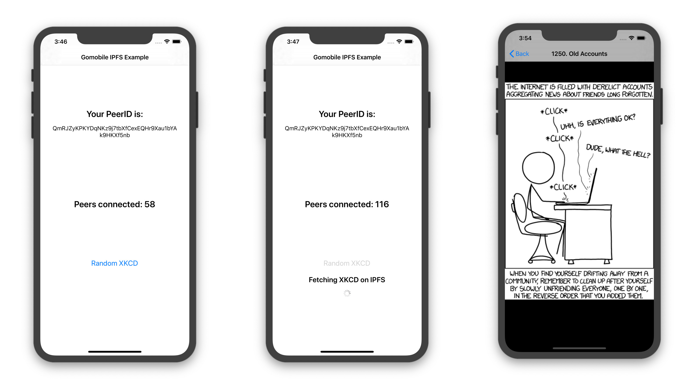
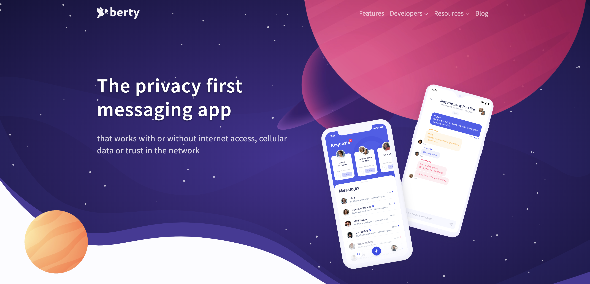

As promised last week, we have some great news to announce today 😉! Happy reading!

# Current Work

## Tech:

### gomobile-ipfs is (almost) complete!

The initial implementation of the gomobile-ipfs packages for Android and iOS is complete and awaiting a review by the Textile and Protocol Labs teams!

Here are some screenshots of our not-so-beautiful example application used as a how-to for devs who want to use the lib:

There is a little bit of polish missing before we can put it in open source (we need to update the outdated README, add more tests, comments in the code, etc...), **BUT** for those of you who are particularly interested in the project, you can get a preview access to the repo by clicking here:

👉 https://github.com/berty/gomobile-ipfs

(and if you don't have access yet, fill this form https://crpt.fyi/gomobileipfs)

Regarding gomobile-ipfs: Guilhem continues to work on a PR that will add functionality allowing direct connections between peers.

### In a nutshell
* **OrbitDB**: Guillaume finished reorganizing the integration of OrbitDB in Berty.
* **Buildkite**: Norman migrated CI to buildkite, and Manfred totally cleaned up old CIs (GitHub actions & CircleCI). We now build way faster <3
* **Screens**: Clément continued with the component, still on its way.
* **Navigation**: Godefroy (we call him 'Gody') finished the navigation integration! Woop woop!
* **Protocol**: Guillaume started a more friendly crypto/protocol doc, with schemas, diagrams, colors, with a focus on different topic on each page.

Congrats to all for the job done this week 👏

## Ops:

### Website: To infinity and beyond! 🚀

Alex has worked long and hard on the V2 of our website to make it fit into our new communication universe.

And good news: it's been online for a couple of hours.  You should definitely have a look, we swear it's worth it! She's done an awesome job! Congrats, Alex 👏👏

👉 https://berty.tech

### Paris P2P #4
As every first Wednesday of every month, we participated in the ParisP2P event in Paris.  It was great to take the time to talk with everyone (not only about Berty, but about p2p in general). We see more and more new faces, and it's terrific! 🙃

This edition (#4) was special because there was no lecture, but a big focus on the upcoming P2P festival in Paris in January.  We are all excited to be a part of it.

This free festival will be over 5 days long, including a conference, hackathon, various workshops. The objective is to propose meetings around all the themes related to Peer-to-Peer and cryptography.

👉 More info about the festival: https://p2p.paris/festival

## Weekly Sync

Read our [Weekly Sync](https://github.com/berty/mgmt/blob/master/meeting-notes/2019/Q4/2019-12-06--staff-team-weekly-sync.md)
