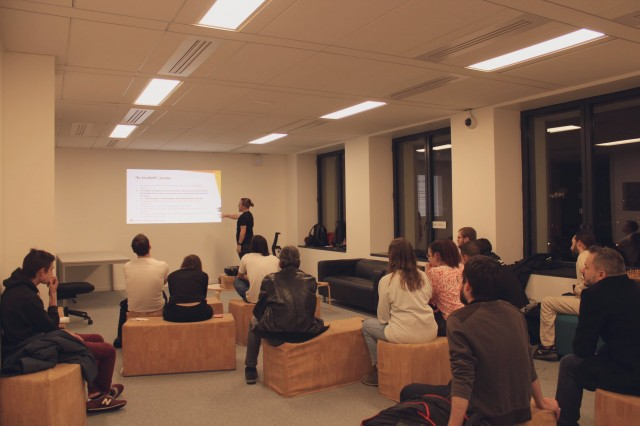

Hello to all! We hope you are well!

This week the newsletter is on **Friday the 13th**! Coincidence? We don't think so. 😅

Happy reading, folks!

# Huidig werk

## Tech

### Berty Protocol

**Manfred** and the technical team worked in-depth on long-term and short-term consumption of the Berty Protocol. There are numerous edge cases and that raise many challenges, like:
  * How will the consumption of bertyprotocol API be realized for external contributors?
  * Should we support event sourcing, and where?
  * How related are the Contact, IncomingContactRequest and OutgoingContactRequest entities?
  * How to deal with OutgoingContactRequest cancellation (discard VS block VS not possible)?
  * Solo bertyprotocol package VS bertyprotocol/core + bertyprotocol/highlevel SDKs
  * Is "bertychat" a normal bertyprotocol client or will it use a privileged API?

If, by any chance, you are a big API fan: come and talk to us, we need your insights and suggestions! 🤓

### StoryBook

[Storybook](https://storybook.js.org/) is a user interface development environment and playground for UI components. The tool enables developers to create components independently and showcase components interactively in an isolated development environment.

This week, **Gody**, our front developer, started to separate the styles from the storybook to better manage the themes and pixel ratio. We'll keep you informed!

### Berty Secret Store
**Antoine**, our lead R&D, has finished setting up the Secret Store. Basically, the Secret Store is used to exchange encryption keys that will be used to decrypt messages.

For instance, if you join a messaging group which already has two people:
* You will have to give the keys which you'll use to encrypt your messages with the person #1 and #2.
* You will have to get the keys from person #1 and #2 as well.

All this will be done through the Secret Store. 🤫

### Proxy Stream
**Guilhem** finished the proxy stream on _iOS_ but there is a little cleanup left before showing you the result.

## Ops

### Berty Tech Website

After giving the website a design overhaul, **Alexandra** continued  by adding custom section thumbnails on the berty.tech website with the help of **Cassius**. This allows you to have nice thumbnails when you share something from the site.

### Lyon P2P #1

This Wednesday, **Manfred, Alex and Gody** participated in Lyon P2P #1. According to them, they had a blast! 😀

It's great to see that the FranceP2P project is now expanding to Lyon, and we hope to see more cities in the future!

Manfred showed his new talk on **Cryptography Intro for Devs** at Lyon P2P.

We met some great people behind [Rust libp2p](https://github.com/libp2p/rust-libp2p). They did an amazing job porting _libp2p_ with _Rust_. It was great to talk to them!

You guys rock 🤘

## Meet Berty

* 17 December 2019: [Meetup GoLang](https://www.meetup.com/fr-FR/Golang-Paris/events/267027868/) (Paris, FR 🇫🇷)
* 8-12 January 2020: [Paris P2P Festival #0](https://p2p.paris/en/event/festival-0/) (Paris, FR 🇫🇷)
* 1-2 February 2020 : [FOSDEM](https://fosdem.org/2020/) (Brussel, BE 🇧🇪)
* 5 February 2020: [Paris P2P #6](https://p2p.paris/en/event/monthly-6/) (Paris, FR 🇫🇷)

## Wekelijkse Sync

Read our [Weekly Sync](https://github.com/berty/mgmt/blob/master/meeting-notes/2019/Q4/2019-12-13--staff-team-weekly-sync.md)
