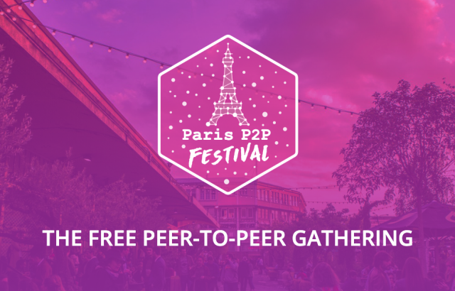

Ho Ho 🎄

This newsletter is an opportunity for us to wish a Merry Christmas to our entire community and thank you for being a part of it! We are very touched by all the messages and encouragements we receive. We truly have the best followers!

Merry Christmas and happy holidays to you all! 🎁

# Current Work

## Tech

### Front
* **Navigation**: Clément finished the screens using his freshly implemented ModalComponent and started the navigation implementation with the help of Gody
* **Onboarding**: Godefroy refactored this step to make it better 👌

### Gomobile-IPFS
Norman started the implementation of the React-Native module and Guilhem split the header into sessionID/payload on gomobile-ipfs proxy.

### Secret Store
Antoine has changed the logic of the inter-log synchronization to make it non-blocking while still being able to send events as soon as they are ready.

### API
Guillaume and Manfred have made an initial event-sourcing-friendly version of the Berty protocol API used for communication between the UI and the core of the application.

## Ops

### FAQ
Camille has finished the first round of writing the FAQ. It's almost complete, some information is still missing before putting it online. बने रहें!

### Golang Paris

Manfred, our CEO, gave a talk for the 10th anniversary of Go in Mobiskill office (thanks again for the welcome).

He presented the usage of P2P, IPFS and crypto with Go. He took as an example... Berty, of course!

Thank you all for coming, and a special round of applause to Fred for the organization.

👉 Here is the link to the slides: https://crpt.fyi/manfred-golang

### Paris Festival #0

And once again, at the beginning of January, the first ParisP2P festival will take place. We'll be there and we really hope to meet you.

👉 Register here: https://p2p.paris/festival/

It's the opportunity to:

* to learn a lot about P2P & decentralization
* to discover new aspects of P2P (DAO, painting, talks...)
* to make new friends
* to have a few drinks

Did we mention that it's totally free? You don't have any good reasons not to show up now, right? 🙃

## Meet Berty

* 8-12 January 2020: [Paris P2P Festival #0](https://p2p.paris/en/event/festival-0/) (Paris, FR 🇫🇷)
* 1-2 February 2020: [FOSDEM](https://fosdem.org/2020/) (Brussel, BE 🇧🇪)
* 5 February 2020: [Paris P2P #6](https://p2p.paris/en/event/monthly-6/) (Paris, FR 🇫🇷)

## Weekly Sync

Read our [Weekly Sync](https://github.com/berty/mgmt/blob/master/meeting-notes/2019/Q4/2019-12-20--staff-team-weekly-sync.md)
