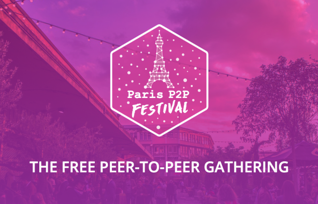
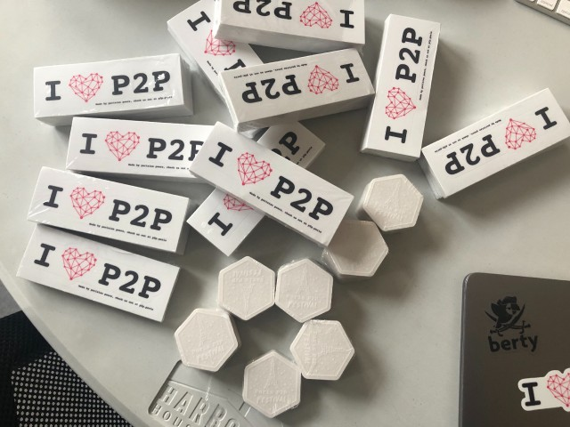
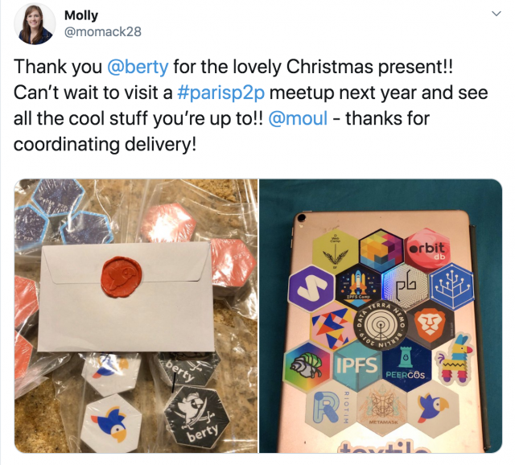

Dear Reader,

The whole Berty team wishes you a Happy New Year 2020. :gift:

We truly hope that you had a great end-of-the-year celebration  and that 2020 will be a year full of great achievements for your projects.

We would like to take this time to thank you sincerely for following our journey: our community is growing every single day, and it is very touching. We have the best community and we are very proud of it. So just thank you!  :blue_heart:

Cheers, friends!

# Huidig werk

A lot of our team members were on vacation but we still have a lot to tell you :smirk:

A new year means new resolutions!

## Tech

### Roadmap Pivot

The first target is to have **a berty-chat app asap**. To achieve this, the chat team is going to work on **v2 of "yolo" release system** and directly use **[go-orbit-db](https://github.com/berty/go-orbit-db) and native IPFS node** to create logs and send messages without using the **Berty Protocol**. Then, they will use **[gomobile-ipfs](https://github.com/berty/gomobile-ipfs)** instead of the IPFS node, and finally will switch to the Berty Protocol when the protocol team is ready.

The second objective is to **capitalize the tests of the protocol team**. So, we are going to create a dedicated **Berty Demo** mobile application, directly developed by the protocol team.

### In a nutshell

* Godefroy set up everything (Kanban, issues, deadline...) for the MVP-Chat,
* Clément is implementing stories & styles,
* Guilhem is working on the new Berty Demo service implementation with go-orbit-db; also working on the mobile bridge,
* Guillaume and Antoine are finalizing the initial secret store implementation,
* Alex did a lot of little things for the Paris P2P festival (designing and ordering the badges, banners, worked on the website...).

## Ops

### Paris P2P Festival

The aforementioned P2P Paris festival will take place next week. The list of speakers and events is just HUGE!

:point_right: https://berty.tech/blog/paris-p2p-festival/

We'll be presenting:

* Mainstream Introduction to the Berty Protocol, by Manfred Touron
* Introduction to IPFS and Berty Protocol, by Antoine Eddi
* How to Join and Contribute to Open Source Communities, by Manfred Touron

We'll try to share as much information as we can on Twitter! Follow us: https://twitter.com/berty

We are so thrilled to be a part of this event. Who's coming?

### Planetiers World Gathering 2020

We are filling out our application for the PWG 2020 in Lisbon, Portugal. For those who don't know PWG, it's the world's biggest event on sustainability innovation!

We are happy to participate in this wild project!

Are any of you coming? If so, let us know, we'll be hanging around together  :smile:

:point_right: More details: https://www.worldgathering.planetiers.com/

## Meanwhile on Twitter

### Molly from IPFS

## Meet Berty

* 8-12 January 2020: [Paris P2P Festival #0](https://p2p.paris/en/event/festival-0/) (Paris, FR 🇫🇷)
* 1-2 February 2020: [FOSDEM](https://fosdem.org/2020/) (Brussel, BE 🇧🇪)
* 5 February 2020: [Paris P2P #6](https://p2p.paris/en/event/monthly-6/) (Paris, FR 🇫🇷)
* 23-25 April 2020: [PWG 2020](https://www.worldgathering.planetiers.com/) (Lisbon, PT 🇵🇹)

## Wekelijkse Sync

Read our [Weekly Sync](https://github.com/berty/mgmt/blob/master/meeting-notes/2020/Q1/2020-01-03--staff-team-weekly-sync.md)
