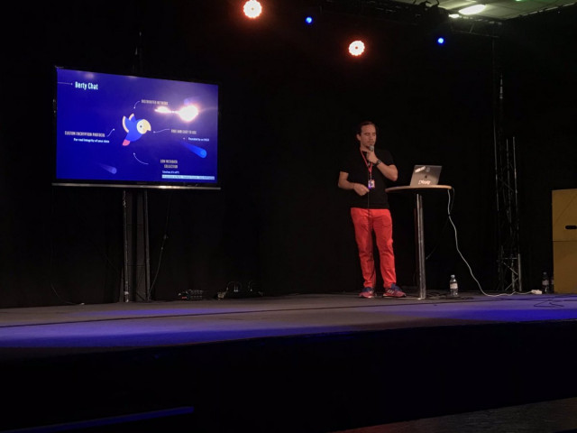
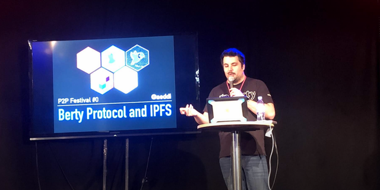

Hi there 🙂

A few of you have asked us why there was no newsletter last week. It's nice to know that you're waiting for the team news!

That being said, the reason is pretty straightforward: a large part of the team was busy at the P2P Festival #0 in Paris (see below).

**NB:** *From now on, Berty newsletter won't be strictly "Friday weekly" - we'll be sending one whenever we have important things to share, once in about 1-2 weeks.*

However, here we are, we're back. Ready to share the team's achievements.

Enjoy your 2 weeks' recap, kids! 😘

# Huidig werk

## Tech

### Berty Protocol Architecture

The original paper [(available on our website)](https://berty.tech/docs/protocol/) will be updated soon, as it becomes _very_ obsolete. Antoine and Guillaume are currently working on the Berty Protocol. They streamlined a lot of topics related to the group management and investigated having third-party nodes acting as replicators. Now they have to write everything. We wish them good luck! 🍀

### Berty Protocol Implementation

Guillaume improved the secret store and changed events to include additional contexts (event id, parents, etc...).

Manfred started refactoring the go-ipfs-log golang structure (https://github.com/berty/go-ipfs-log/pull/30)

### Gomobile IPFS

`gomobile-ipfs` is _almost ready!_

Antoine and Guilhem implemented the last changes requested by the IPFS team in the PR review (for example, they replaced command methods with RequestBuilder on iOS/Android). When the changes are validated by the IPFS team, we will open-source the initial version of the repo and move it to an IPFS official GitHub organization.

Guilhem added “Unix Domain Socket” support on ipfs/go-ipfs-api (https://github.com/ipfs/go-ipfs-api/pull/202).

### App Testing and Distribution

As you may know, we decided to quickly develop the 'yolo' distribution platform, to make early versions of Berty v1 available to beta testers and get feedback on our work.

We started implementing the v2 of Yolo to go along with the v2 of Berty. More information will follow soon!

### Berty Demo

Godefroy finished setting up the Berty store based on saga pattern (see also: https://microservices.io/patterns/data/saga.html). He's also currently implementing the account creation: the store part is already done, he started working on the UI integration.

This week, Clement worked on styles, so they will scale on different displays. It's in progress, but he did a great job!

Guilhem implemented a CLI client for the Berty Demo (binded with Berty Protocol).

Norman, Guilhem and Godefroy worked on setting up every part required for the demo to work, including:

* Guilhem integrated the Berty Demo gRPC service on Android/iOS
* Godefroy mocked the protocol and set up the Berty Demo to access OrbitDB
* Norman has implemented Berty Demo gRPC methods

## Ops

### Paris P2P Festival

As previously announced, [Paris P2P festival](https://p2p.paris/fr/event/festival-0/) was taking place at Ground Control in Paris from Wesnesday to Sunday, and it was just **HUUUUUUUUUUGE**! 😄

So many crazy folks, so many talks, so many workshops during this event. Manfred and others had discussions with many very interesting people, including people from the legal, political and technical world with their own projects, people who want to work at Berty, activists who want to use Berty to protect their communication.

**Manfred presented two talks during the Paris P2P Festival:**

- "General presentation of Berty". The video is available on Youtube: https://p2p.paris/en/talks/maintream-intro-berty-protocol/ .
- "How to Join and Contribute to Open Source Communities": https://p2p.paris/fr/talks/join-contribute-open-source-projects/

**Pierre did a talk about Social Engineering:**

- https://p2p.paris/en/talks/social-engineering-mentalist/

**Antoine presented an introduction to IPFS and Berty Protocol:**

- https://p2p.paris/fr/talks/introduction-ipfs-berty-protocol/

:point_right: You can have a look at the full agenda here: https://p2p.paris/en/event/festival-0/#schedule

:point_right: All talks were recorded: https://www.youtube.com/playlist?list=PLNb0kW7AIrdw9Jjh08v00SznT-gT4Apw

We are looking forward to these meetings, and we will be happy to see you at the next festival if you were not able to attend. 😉

Manfred, Zooma, Alex, Antoine, Zaraki, Phil, and many others participated in the general organization of this festival to create the best conditions for everyone. **A big thank you to all of them. 👏**

## Meet the Berty Crew

* 1-2 February 2020: [FOSDEM](https://fosdem.org/2020/) (Brussel, BE 🇧🇪)
* 5 February 2020: [Paris P2P #6](https://p2p.paris/en/event/monthly-6/) (Paris, FR 🇫🇷)
* 4 March 2020: [Paris P2P #7](https://p2p.paris/en/event/monthly-7/) (Paris, FR 🇫🇷)
* 23-25 April 2020: [PWG 2020](https://www.worldgathering.planetiers.com/) (Lisbon, PT 🇵🇹)

## Wekelijkse Sync

Read our Weekly Sync: [2020-01-10](https://github.com/berty/mgmt/blob/master/meeting-notes/2020/Q1/2020-01-10--staff-team-weekly-sync.md) [2020-01-17](https://github.com/berty/mgmt/blob/master/meeting-notes/2020/Q1/2020-01-17--staff-team-weekly-sync.md)
