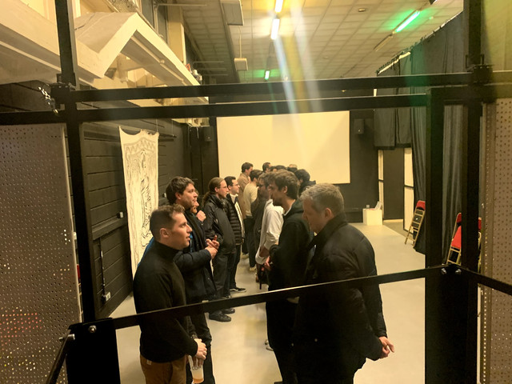

Hi folks!

We are delighted to meet you again. A lot has happened in the last two weeks. So, without further ado, buckle up, let's get this newsletter on the road! 🚀

Happy reading & happy valentine's day!

# Current Work

## Tech
Here's what our tech team is up to:

### Berty Demo

The front team's current priority is to have a Berty-chat MVP, and good news: it's on its way!

Today's focus is on having a complete implementation of what we call the "group flow". This demo will not implement any kind of crypto. The goal is rather to test the network and the communication between the frontend and the backend. In a nutshell, these are the steps a user will take from the time they create their account to the time they have a conversation. It includes sending a contact request, creating a conversation and exchanging messages in it. We are currently brainstorming on the best option to have a group creation and its flow that fits the Berty Protocol.

* Clement and Norman brainstormed and started implementing the group flow this week
* Norman and Clément implemented the contact request
* Norman implemented the contact list. He worked as well on the MVP bridge (link between the front and the back)
* Clément started the implementation of the 1to1 conversation
* Guilhem worked on a few small things on the back

### Build Infrastructure

Guilhem finished fixing the iOS build on buildkite! This will allow us to have regular releases of the app published on Yolo (our internal release system, more info soon™) and to be able to easily have a new version of the application tested by the team members and friends. 🎉

### Berty 协议

Guillaume finished the initial implementation of the message store! Well done!

Guillame worked as well on adding helpers to sync the secrets from/to the metadata store from/to the message secret store. He is currently working on `bertymini`, a CLI Berty client using both stores on an ephemeral group (pretty much the same behavior of the demo in the group package) and it works. The purpose of `bertymini` is to test and benchmark the protocol (including the network and crypto parts) easily during its implementation.

## Ops

### Memories of FOSDEM 2020

Two weeks ago we went to [FOSDEM](https://berty.tech/blog/berty-at-fosdem-2020/) in Brussels, Belgium. It was really cool! What a crazy event!

We made a blog post dedicated to our memories. We wrote it as a travel blog post. We hope you'll like it.

👉 Read our blog post: [Memories of Fosdem 2020](https://berty.tech/blog/post-fosdem-2020/).

Zöôma, the CEO of the [Samourai Cooperative](https://www.cooperativesamourai.com/) with whom we work regularly, was with us. He took the opportunity to make a little video.  It's short and so awesome. Check it out:

We really hope to be a part of FOSDEM 2021 and share more beers with you guys! Cheers!

### Paris P2P #6

Last week, like every beginning of the month, the monthly Paris P2P event took place. For the edition #6, five members of the Berty team were present.

A little proud moment: it's incredible to see these events become permanent with more and more attendees. We're starting to be active in the Parisian ecosystem of the P2P and cryptography world. Whoop-whoop!

### New blog post
 As a reader of this newsletter, you already knew this: we released "gomobile-ipfs" a few weeks ago. We've just published an article to publicly announce its release.

👉 Read our blog post: [Berty releases gomobile-ipfs](https://berty.tech/blog/go-mobile-ipfs/).

### Collaboration

* **Skillz** Last week, Manfred met with the start-up [Skillz](https://www.skillz.com/). They're working on a block chain infrastructure. Skillz and Berty share similar challenges

* **Jorropo** Manfred met github.com/jorropo, who is also contributing to the IPFS ecosystem

* **Protocol Labs** Manfred spoke with [Protocol Labs](https://protocol.ai/) to understand how they manage their “centralized” public services, i.e. IPFS-gateway, official bootstrap nodes.

* **Acorus Network** Manfred contacted the CEO of the [Acorus network](https://www.acorus-networks.com/), one of the leaders in the anti-DDOS ecosystem, for information on P2P protection.

## Welcome, Rémi!

In the last newsletter, we announced the arrival of Morgane. This week, we are delighted to introduce you to Rémi.

Formerly an osteopath, Rémi is reconverting his professional career since 2017 to finally devote himself to his childhood passion: computers & IT. During his education at school 42, he specialized in the development of embedded systems and Unix systems with a focus on security.

Today at Berty, he starts a new challenge in the field of low-level mobile development, the Bluetooth Low Energy (BLE) driver with the help of Antoine. You know how important Bluetooth is to us at Berty, so we're pleased to welcome him to our team.

Sacré blue (...tooth)! 🙂

## Meet the Berty Crew

* 4 March 2020: [Paris P2P #7](https://p2p.paris/en/event/monthly-7/) (Paris, FR 🇫🇷)
* 13 March 2020: [Nantes P2P #0](https://www.meetup.com/fr-FR/France-P2P/events/265590853/) (Nantes, FR 🇫🇷)
* 23-25 April 2020: [PWG 2020](https://www.worldgathering.planetiers.com/) (Lisbon, PT 🇵🇹)

## Weekly Sync

Read our Weekly Sync: [2020-02-14](https://github.com/berty/mgmt/blob/master/meeting-notes/2020/Q1/2020-02-14--staff-team-weekly-sync.md) [2020-02-07](https://github.com/berty/mgmt/blob/master/meeting-notes/2020/Q1/2020-02-07--staff-team-weekly-sync.md)
