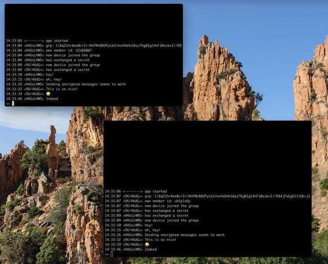
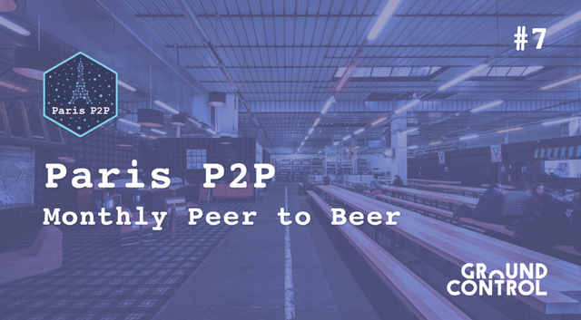
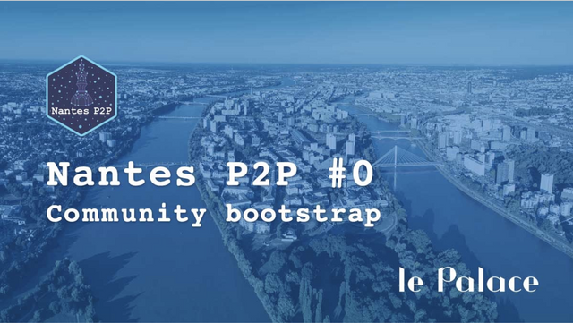
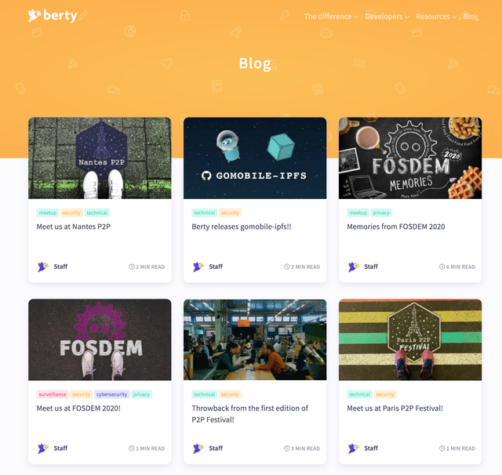

Hello to all parrot lovers!

We're delivering your dose of Berty information! :100:

Happy reading :)

# Current Work

## Tech

Here's what our tech team is up to:

### Hot News 🔥🔥🔥

Manfred and Guillaume managed to have their first conversation on their terminal using the Berty Protocol! **Woot woot, Berty is coming!**

### Berty Demo

Berty Demo is the app we use to progress on the UI and validate it before having the whole Berty Protocol ready.

Norman finished the Contact List, Conversation Create and Conversation Delete features and started coding the Multi-Member Conversation.

Clément implemented the creation of 1-to-1 conversations. He had problems dealing with the account deletion and will need to improve it.

### Rendezvous service

The rendezvous service is a component intended to locate peers, without leaking information or long-term references.

It will use multiple drivers, as some are going to be more suitable according to the context. Currently planned drivers include local discovery (using either mDNS or Bluetooth), the IPFS DHT and a centralized service as a fallback.

Guilhem designed it along with Antoine. He focused on having mocked and centralized services first, and will need some tweaks to Gomobile-IPFS to proceed.

### Yolo

Yolo is a tool we use internally to distribute our candidate builds and have an easy way of testing them on various devices.

Manfred has added support for Bintray as a CI backend to Yolo. This adds up to Buildkite and CircleCI, which were already supported.

It needs a few more refinements to be shared, but we hope to do it asap!

### Le protocole Berty

Guillaume completed the message store, with messages being encrypted according to the protocol specifications. His main focus now is on having the account key store persistent.

### Bluetooth Low Energy (BLE) comms

Rémi continued the implementation of the BLE driver on Android. It can scan and advertise (say "I'm here"), connect to another device, establish a connection, check whether the other device is running Berty, find its Peer ID. It's fast and it works. Congrats!

### Gomobile-IPFS

Antoine worked on the `gomobile-ipfs` CI. He switched from Bitrise to Github Action because it's much more integrated and runs faster.

### Go ports of OrbitDB and ipfs-log

Guillaume improved the Go port of OrbitDB by removing callbacks in the event system and replacing them with channels. He also caught up with the progress on the ipfs-log side.

## Ops

### Paris P2P #7

As usual, we'll be at the monthly Paris P2P event. This edition #7 (already!) will take place on March 4th at Ground Control.

Pierre, our operational manager, will give a conference titled: "The lecture I won't be allowed to give in China". Wish him good luck!

And as always, we'll be available to chat over a beer ...or two.🍻

More info: https://p2p.paris/en/event/monthly-7/

### Nantes P2P #0

We are delighted to see the ParisP2P movement spreading. After LyonP2P, it's now NantesP2P. So make a note in your diaries of **March 14th**!

Part of the team will be there to help with the setup. So if you wanna chat, feel free to come!

We wrote a blog post that gives you all the details about this new rendez-vous: https://berty.tech/blog/berty-at-nantes-p2p/

Don't forget to poke your friend from Nantes!

### Website Update

This week, Alex has been been rethinking our [blog posts](https://berty.tech/blog). So, she created and updated the images of posts for IPFS Camp, Paris P2P and Nantes P2P.... They're great, thank you, Alex 👏.

Alex also added a few fun posters made by zöÔma to [assets.berty.tech](https://assets.berty.tech/). Have a look ;)

## Meet the Berty Crew

* March 4, 2020: [Paris P2P #7](https://p2p.paris/en/event/monthly-7/) (Paris, FR 🇫🇷)
* March 13, 2020: [Nantes P2P #0](https://www.meetup.com/fr-FR/France-P2P/events/265590853/) (Nantes, FR 🇫🇷)
* April 1, 2020: [Paris P2P #8](https://p2p.paris/en/event/monthly-8/) (Paris, FR 🇫🇷)
* April 23-25, 2020: [PWG 2020](https://www.worldgathering.planetiers.com/) (Lisbon, PT 🇵🇹)

## Weekly Sync

Read our Weekly Sync:

[2020-02-28](https://github.com/berty/mgmt/blob/master/meeting-notes/2020/Q1/2020-02-28--staff-team-weekly-sync.md)

[2020-02-21](https://github.com/berty/mgmt/blob/master/meeting-notes/2020/Q1/2020-02-21--staff-team-weekly-sync.md)

